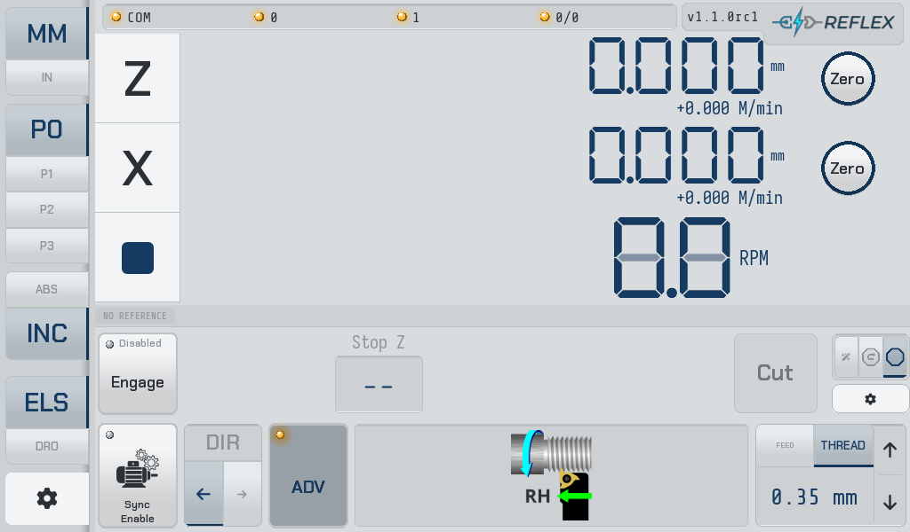

# Reflex

A **Digital Read-Out (DRO) and Electronic Leadscrew (ELS) system for manual
lathes**: an STM32-based real-time motion controller and a Kivy touchscreen UI,
talking RS-485 Modbus RTU. One system, one repository.

**📖 [Read the user guide](https://funkenjaeger.github.io/reflex/)** —
the screen explained, a walkthrough per job, and every refusal the controller
can give you with what to do about it.

| Path | What it is |
|---|---|
| [`fw/`](fw/) | STM32F411 firmware — 100 kHz motion ISR, FreeRTOS, Modbus RTU slave. Includes a native Linux emulator that compiles the real firmware sources against simulated lathe physics. |
| [`ui/`](ui/) | Kivy DRO/ELS touchscreen app, Modbus master — Raspberry Pi at the machine, or desktop (Windows/macOS/Linux) for development. |

---

## 📸 What it does

Home screen in ELS mode with the advanced bar expanded, in **stop-only** mode
(see [Stop modes](#-stop-modes) below):

| Dark | Light |
|------|-------|
|  |  |

[](https://www.youtube.com/watch?v=38qAaq2tOGU)

* Multi-axis DRO with configurable axes, hardware scale inputs, and transforms
* **Electronic leadscrew**: spindle-synchronized carriage feed for power feeding
  and threading
* **Automatic electronic stop** — feed or thread up to a shoulder, hands off
* **Electronic retract**, and automatic **phase re-sync to thread pitch**
  between passes (free use of the half nut between threading passes)
* Jogging with trapezoidal velocity profile

The firmware owns everything real-time (encoders, step generation, the stop);
the UI owns operator workflow, configuration, and display. The wire between
them is a memory-mapped register contract guarded by `protocolVersion`.

---

## 🎛 Stop modes

The electronic **stop** is what makes this more than a leadscrew — and it is
optional. Disengage it and Reflex is a traditional ELS. The three modes are not
difficulty levels; they are three different amounts of the job the controller
takes over, over the same take-up confirmation and the same thread datum.

| Mode | What you set | Between passes |
|---|---|---|
| **Stop-only** | Stop Z | Nothing. The return and the depth of cut are yours, as with a carriage stop. |
| **Stop + retract** | Stop Z, Start Z | **Retract** returns the carriage under power, when you press it. |
| **Wizard** | Nothing typed — drive to each position and press **Set** | Runs the cycle Cut → Retract → Cut. |

Backing off in X is your hand in every mode: there is one servo, and it drives
the leadscrew.

> [!CAUTION]
> **Get the tool clear in X before pressing Retract** — it feeds the carriage
> back under power, and a tool still in the groove is dragged along the thread.
> Wizard mode gates the button on a committed diameter; stop + retract has none
> to compare against.

**[The three stop modes, in full →](https://funkenjaeger.github.io/reflex/guide/operator-modes/)**

### Past the stop

Two things most ELS projects do not do:

**[Pick up an existing thread](https://funkenjaeger.github.io/reflex/guide/picking-up-a-thread/)**
— a guided procedure that latches a thread reference on work this job did not
cut: a re-chucked part, a thread cut elsewhere, a damaged thread being chased.

**[Widen a groove past the tool that cuts it](https://funkenjaeger.github.io/reflex/guide/widening-a-groove/)**
— a thread phase offset, stepped along between passes, so a narrow tool cuts a
wide groove.

Underneath both, in every mode: **thread phase is re-derived from the Z scale
after every pass.** Stopping decouples spindle sync, so re-deriving phase from
the scale is what puts the next pass in the same groove — and what lets you
open the half nut between passes.

---

## 🗺 Versions

The living record: what shipped and what is planned, in one place so the two
cannot drift apart. Entries move from **planned** to **released** as tags are
cut, and the plan is revised as often as reality requires.

### 1.0.0 · released 2026-07-15

The first release, as two separately versioned repositories (`reflex-fw` and
`reflex-ui`). A working DRO with an electronic leadscrew behind it.

- **Multi-axis DRO** — configurable axes over hardware scale inputs, with transforms and offsets.
- **Electronic leadscrew** — spindle-synchronised carriage feed for power feed and threading.
- **Electronic stop** — feed or thread up to a shoulder and stop, hands off.
- **Electronic retract**, and the advanced ELS bar.
- Jogging with a trapezoidal velocity profile.

### 1.1.0 · released 2026-08-31 — **current**

The release where the controller stops trusting and starts **verifying**.

- **Take-up confirmation** — checks the carriage really moved before every pass, or refuses it.
- **Backlash calibration** — measures take-up on the machine instead of taking a guess.
- **Thread phase re-sync from the Z scale** — open the half nut between passes.
- **Pick up an existing thread** — latch a reference on work this job did not cut.
- **Thread phase offset** — cut a groove wider than the tool, stepping phase between passes.
- **Opt-in error reporting** — no built-in destination; set `REFLEX_SENTRY_DSN`, or leave it off.
- **Half the interrupt budget back** — 50 kHz step generation, sustained ISR load 40% to 20%.
- **One repository, one version** — `fw/` and `ui/` released together, history preserved.
- **A user guide**, from installing on a Pi through to picking up an existing thread.
- Improved status indication and operator-facing messages.
- In-app update screen withdrawn; updating is a `git pull` and, when firmware moves, a flash.

### 1.2.0 · planned — auto-start

Take the last button press out of the cycle.

- **Begin the pass when the half nut closes**, rather than on **Cut**.
- **Sensorless** — infers engagement from motion already measured for the take-up.
- Developed desk-first against the firmware emulator, with a machine window to verify.

### 1.3.0 · planned — auto-advance, the virtual compound

Take the depth of cut out of your hands as well.

- **Advance thread phase from X depth** — a flank infeed with no compound set over.
- Threading illustrations re-tooled as programmatic SVG, regenerated like the screenshots.

### 2.0.0 · planned — the respin

The first release that needs **new hardware**, which is why it is a major
version rather than 1.4.

- **Control-board respin for differential encoder signalling.**
- **Register-block integrity checksum** and **index-anchored phase correction**.
- The **mod-lead fix** multi-start threading would need. Whether multi-start
  itself is built here is not yet decided.

> [!NOTE]
> **Multi-start is not supported**, and cannot be before 2.0.0 — it needs the
> mod-lead fix above. The phase offset is not a substitute for it either: its
> correction folds within one pitch and biases into the
> cutting direction, which is exactly wrong for indexing a second start.
> See [Widening a groove](https://funkenjaeger.github.io/reflex/guide/widening-a-groove/).

The long form — reasoning, sequencing, risks — lives in the project roadmap
rather than here.

---

## 🔩 Hardware

* STM32F411 controller board — compatible with the
  [rotary-controller-pcb](https://github.com/bartei/rotary-controller-pcb)
  design (a ready-made board is available from
  [Provvedo](https://www.provvedo.com); no affiliation)
* RS-485 link to a Raspberry Pi 3/4/5 (e.g. via Power Hat) running the UI
* Quadrature encoders on spindle and axes; step/dir servo or stepper on the
  leadscrew

---

## 🧬 Provenance

Reflex is a deliberate **hard fork** of
[rotary-controller-f4](https://github.com/bartei/rotary-controller-f4) /
[rotary-controller-python](https://github.com/bartei/rotary-controller-python),
diverged to focus on lathe use cases (the originals target CNC-style rotary
tables). There is no upstream tracking; divergence is the point.

The two halves lived as separate repositories (`reflex-fw`, `reflex-ui`) until
2026-08-17, when they were welded into this monorepo with **full history
preserved on both sides** — every historical commit is here, path-rewritten
under `fw/` and `ui/`, so `git log -S` / `--follow` work scoped to either
subtree across the whole lineage. Old-repo tags carry `fw-` / `ui-` prefixes.
The old repositories remain frozen as archives. Rationale:
`ui/docs/decisions/repo-structure-monorepo.md`.

---

## 🧪 Tests

```bash
# UI unit suites (from ui/; Linux/WSL — the venv is a Linux venv)
cd ui && uv run --frozen pytest -q

# firmware emulator suite (real firmware C against a host shim)
cmake -B fw/emulator/build fw/emulator && cmake --build fw/emulator/build -j
ctest --test-dir fw/emulator/build --output-on-failure

# full-stack system tests (the UI driving the compiled firmware emulator)
cd ui && uv run --frozen pytest -m system tests/system -q
```

The register-map contract test compares `ui/reflex/utils/devices.py` against
`fw/Core/Inc/Ramps.h` on every run — the firmware is always checked out,
because it lives here.

---

## 🚢 Deployment note

The machine flashes firmware and restarts the UI as **separately deployed
artifacts**, and this board requires a **power cycle** after flashing before
the new firmware executes. The running FW/UI pair can therefore lag any
commit; the `protocolVersion` and `diagSchema` register checks guard that seam
and are permanent, monorepo or not. See `fw/README.md` for the flash
procedure and `fw/DIAG.md` for diagnostic-probe builds.

---

## 🤝 Contributing

Issues, pull requests, testing, and documentation help are welcome.

## 📄 License

MIT — see `fw/LICENSE` and `ui/LICENSE`.
