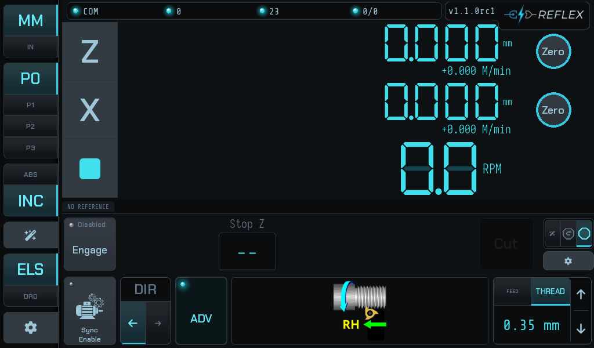
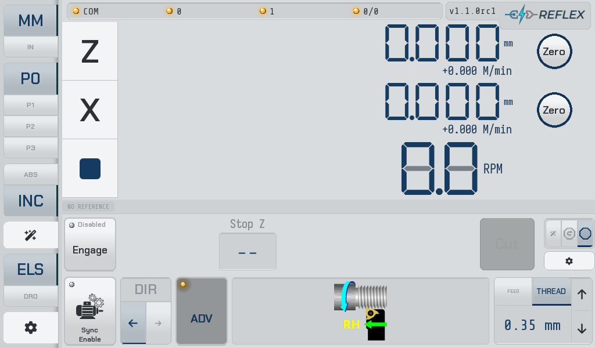
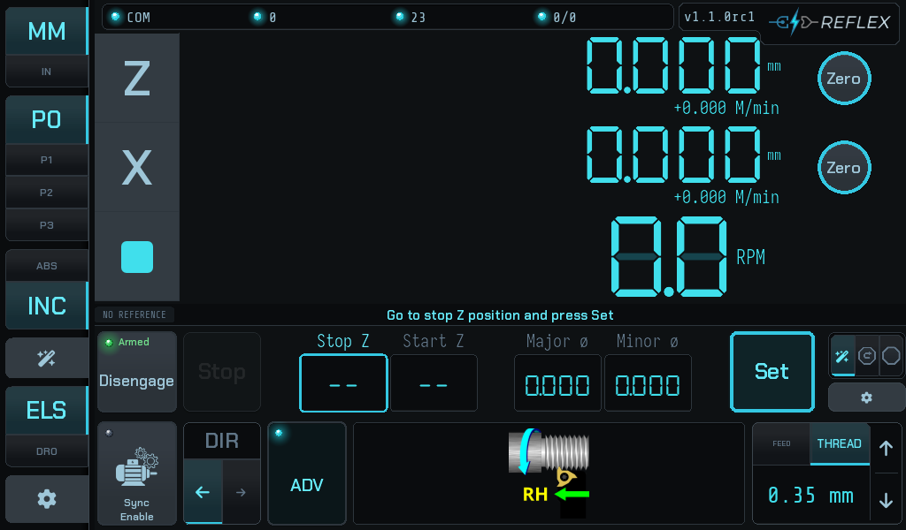
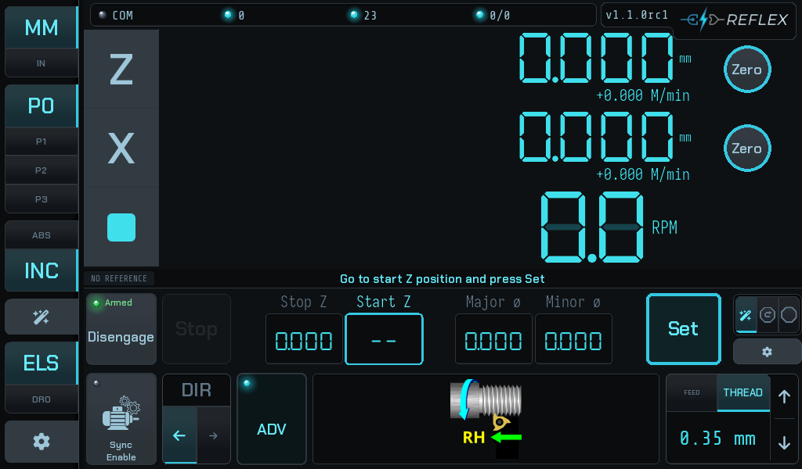
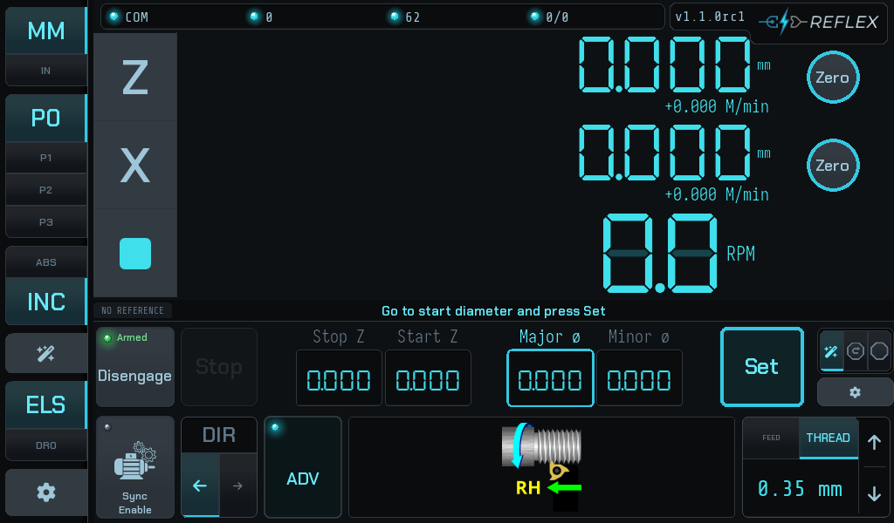
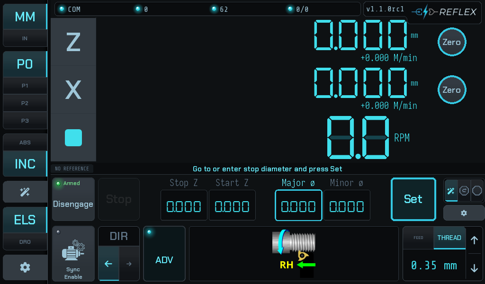
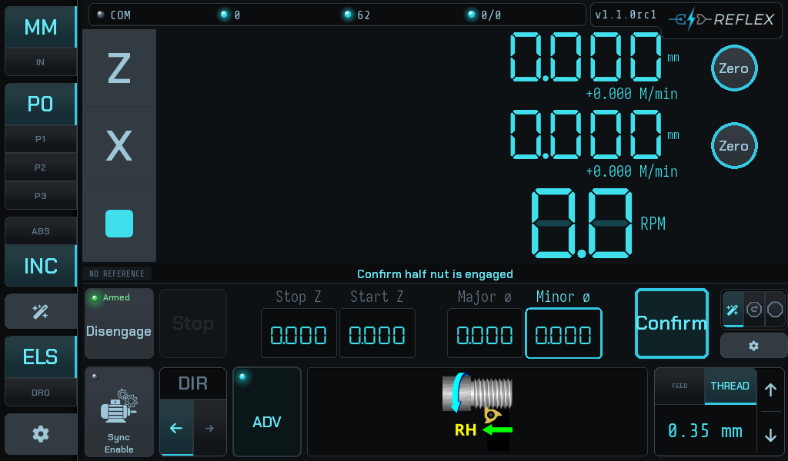
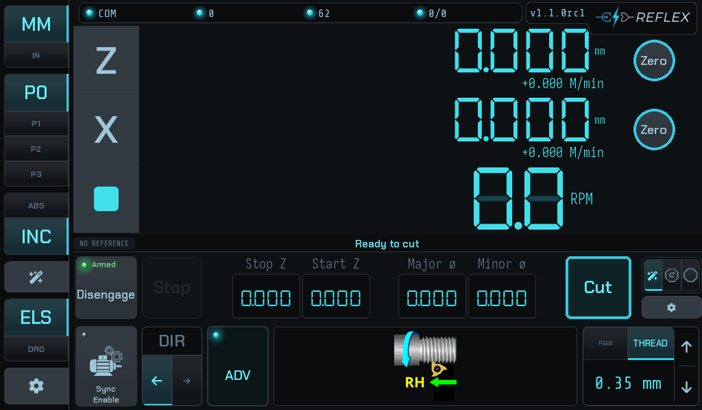

# Reflex

A **Digital Read-Out (DRO) and Electronic Leadscrew (ELS) system for manual
lathes**: an STM32-based real-time motion controller and a Kivy touchscreen UI,
talking RS-485 Modbus RTU. One system, one repository.

| Path | What it is |
|---|---|
| [`fw/`](fw/) | STM32F411 firmware — 100 kHz motion ISR, FreeRTOS, Modbus RTU slave. Includes a native Linux emulator that compiles the real firmware sources against simulated lathe physics. |
| [`ui/`](ui/) | Kivy DRO/ELS touchscreen app, Modbus master — Raspberry Pi at the machine, or desktop (Windows/macOS/Linux) for development. |

---

## 📸 What it does

Home screen in ELS mode with the advanced bar expanded, in **stop-only** mode
(see [Operator modes](#-operator-modes) below):

| Dark | Light |
|------|-------|
|  |  |

[](https://www.youtube.com/watch?v=38qAaq2tOGU)

* Multi-axis DRO with configurable axes, hardware scale inputs, and transforms
* **Electronic leadscrew**: spindle-synchronized carriage feed for power feeding
  and threading
* **Automatic electronic stop** — feed or thread up to a shoulder, hands off
* **Electronic retract**, and automatic **phase re-sync to thread pitch**
  between passes (free use of the half nut between threading passes)
* Jogging with trapezoidal velocity profile

The firmware owns everything real-time (encoders, step generation, the stop);
the UI owns operator workflow, configuration, and display. The wire between
them is a memory-mapped register contract guarded by `protocolVersion`.

---

## 🎛 Operator modes

The advanced bar has three modes, and they are not difficulty levels — they are
three different amounts of the job the controller takes over. All three cut the
same thread; they differ in how much you set up first and how much you do by
hand between passes.

### Stop-only


One field: **Stop Z**. Set the shoulder, engage, press **Cut**, and the carriage
feeds to the stop and holds. Everything else — backing the tool out, returning
the carriage, taking the next depth of cut — is yours, exactly as on a manual
lathe with a carriage stop.

This is the mode with the least to get wrong, and it is what the author runs on
his own machine. The controller still confirms the backlash take-up before every
pass and refuses to start one it cannot confirm, so the protection that matters
is not something you trade away by staying here.

### Stop + retract


Adds **Start Z** and an automatic retract. At the end of a pass the tool comes
out and the carriage returns to the start position on its own, so the cycle is
Cut → Retract → Cut rather than Cut → *four things by hand* → Cut.

This is where the **phase re-sync** earns its keep: the controller re-derives
thread phase from the Z scale between passes, so you are free to open the half
nut and the next pass still lands in the same groove.

### Wizard

The guided setup. Instead of typing values into fields, you drive the machine to
each position and press **Set**, and the bar tells you what it wants next. It
collects the same four values the other modes use, then confirms before the
first cut.

| | | |
|---|---|---|
|  |  |  |
| **1. Stop Z** — run the carriage to the shoulder and press Set. This is the one value every mode needs. | **2. Start Z** — run back to where each pass should begin. The retract returns here. | **3. Start ø** — bring the tool to the work and press Set. The field being captured is outlined. |
|  |  |  |
| **4. Stop ø** — the finished diameter. Drive to it, or type it in. | **5. Confirm** — the one thing the controller cannot check for you is the half nut. It asks. | **6. Ready** — the button becomes **Cut**, and the cycle runs Cut → Retract → Cut. |

The prompt above the fields is the wizard's whole interface: it names the next
value, the field it will land in is outlined, and the action button reads what
pressing it will do. Nothing is captured until you press Set, so you can drive
past a position and come back.

**On choosing a mode.** The wizard is the most guided and puts the most
machinery between you and the cut; stop-only is the least. Neither is safer than
the other in the part that matters — the take-up confirmation, the electronic
stop and the thread datum are the same code in all three.

---

## 🔩 Hardware

* STM32F411 controller board — compatible with the
  [rotary-controller-pcb](https://github.com/bartei/rotary-controller-pcb)
  design (a ready-made board is available from
  [Provvedo](https://www.provvedo.com); no affiliation)
* RS-485 link to a Raspberry Pi 3/4/5 (e.g. via Power Hat) running the UI
* Quadrature encoders on spindle and axes; step/dir servo or stepper on the
  leadscrew

---

## 🧬 Provenance

Reflex is a deliberate **hard fork** of
[rotary-controller-f4](https://github.com/bartei/rotary-controller-f4) /
[rotary-controller-python](https://github.com/bartei/rotary-controller-python),
diverged to focus on lathe use cases (the originals target CNC-style rotary
tables). There is no upstream tracking; divergence is the point.

The two halves lived as separate repositories (`reflex-fw`, `reflex-ui`) until
2026-08-17, when they were welded into this monorepo with **full history
preserved on both sides** — every historical commit is here, path-rewritten
under `fw/` and `ui/`, so `git log -S` / `--follow` work scoped to either
subtree across the whole lineage. Old-repo tags carry `fw-` / `ui-` prefixes.
The old repositories remain frozen as archives. Rationale:
`ui/docs/decisions/repo-structure-monorepo.md`.

---

## 🧪 Tests

```bash
# UI unit suites (from ui/; Linux/WSL — the venv is a Linux venv)
cd ui && uv run --frozen pytest -q

# firmware emulator suite (real firmware C against a host shim)
cmake -B fw/emulator/build fw/emulator && cmake --build fw/emulator/build -j
ctest --test-dir fw/emulator/build --output-on-failure

# full-stack system tests (the UI driving the compiled firmware emulator)
cd ui && uv run --frozen pytest -m system tests/system -q
```

The register-map contract test compares `ui/reflex/utils/devices.py` against
`fw/Core/Inc/Ramps.h` on every run — the firmware is always checked out,
because it lives here.

---

## 🚢 Deployment note

The machine flashes firmware and restarts the UI as **separately deployed
artifacts**, and this board requires a **power cycle** after flashing before
the new firmware executes. The running FW/UI pair can therefore lag any
commit; the `protocolVersion` and `diagSchema` register checks guard that seam
and are permanent, monorepo or not. See `fw/README.md` for the flash
procedure and `fw/DIAG.md` for diagnostic-probe builds.

---

## 🤝 Contributing

Issues, pull requests, testing, and documentation help are welcome.

## 📄 License

MIT — see `fw/LICENSE` and `ui/LICENSE`.
