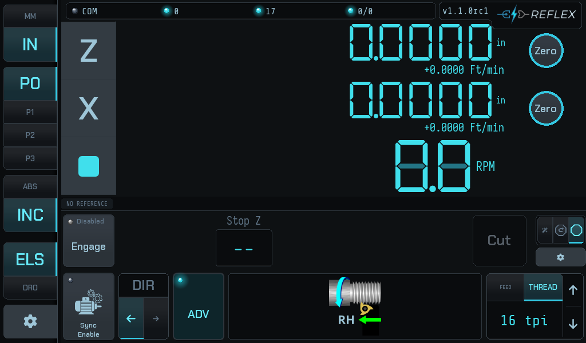

# Reflex

A **Digital Read-Out (DRO) and Electronic Leadscrew (ELS) system for manual
lathes**: an STM32-based real-time motion controller and a Kivy touchscreen UI,
talking RS-485 Modbus RTU. One system, one repository.

| Path | What it is |
|---|---|
| [`fw/`](fw/) | STM32F411 firmware: 50 kHz motion ISR, FreeRTOS, Modbus RTU slave. Includes a native Linux emulator that compiles the real firmware sources against simulated lathe physics. |
| [`ui/`](ui/) | Kivy DRO/ELS touchscreen app, Modbus master: Raspberry Pi at the machine, or desktop (Windows/macOS/Linux) for development. |

**[User guide](https://funkenjaeger.github.io/reflex/)**. Installing:
[`docs/setup/installing.md`](docs/setup/installing.md). Release notes:
[`release-notes/`](release-notes/).



## Project status

Reflex is tested on one lathe and is not a certified safety system. A release
may change the register contract or configuration format without a
migration: read the release notes and keep a backup before updating.

## Stop modes

The electronic **stop** is optional; disengaged, Reflex is a traditional ELS.

| Mode | What you set | Between passes |
|---|---|---|
| **Stop-only** | Stop Z | Nothing. The return and the depth of cut are yours, as with a carriage stop. |
| **Stop + retract** | Stop Z, Start Z | **Retract** returns the carriage under power, when you press it. |
| **Wizard** | Nothing typed: drive to each position and press **Set** | Runs the cycle Cut, Retract, Cut. |

> [!CAUTION]
> **Get the tool clear in X before pressing Retract** — it feeds the carriage
> back under power, and a tool still in the groove is dragged along the thread.
> Wizard mode gates the button on a committed diameter; stop + retract has none
> to compare against.

[The three stop modes, in full](https://funkenjaeger.github.io/reflex/guide/operator-modes/)

## Hardware

* STM32F411 board compatible with the
  [rotary-controller-pcb](https://github.com/bartei/rotary-controller-pcb)
  design (ready-made from [Provvedo](https://www.provvedo.com); no affiliation)
* RS-485 link to a Raspberry Pi 3/4/5 (e.g. via Power Hat) running the UI
* Quadrature encoders on spindle and axes; step/dir servo or stepper on the
  leadscrew

## Tests

```bash
# UI unit suites (from ui/; Linux/WSL — the venv is a Linux venv)
cd ui && uv run --frozen pytest -q

# firmware emulator suite (real firmware C against a host shim)
cmake -B fw/emulator/build fw/emulator && cmake --build fw/emulator/build -j
ctest --test-dir fw/emulator/build --output-on-failure

# full-stack system tests (the UI driving the compiled firmware emulator)
cd ui && uv run --frozen pytest -m system tests/system -q
```

The register-map contract test compares `ui/reflex/utils/devices.py` against
`fw/Core/Inc/Ramps.h` on every run.

## Deployment

Firmware and UI deploy as **separate artifacts**, so the running pair can lag
any commit; the `protocolVersion` and `diagSchema` register checks guard that
seam. An RS-485 firmware update needs no power cycle; an ST-Link flash needs a
**power cycle** before the new firmware executes. Flash
procedure: `fw/README.md`; diagnostic-probe builds: `fw/DIAG.md`.

## Provenance

Reflex is a **hard fork** of
[rotary-controller-f4](https://github.com/bartei/rotary-controller-f4) /
[rotary-controller-python](https://github.com/bartei/rotary-controller-python),
diverged for manual lathes (the originals target CNC-style rotary tables),
with no upstream tracking: [what Reflex changes](https://funkenjaeger.github.io/reflex/vs-upstream/).

## License

MIT; see `fw/LICENSE` and `ui/LICENSE`. Issues and pull requests are welcome.
