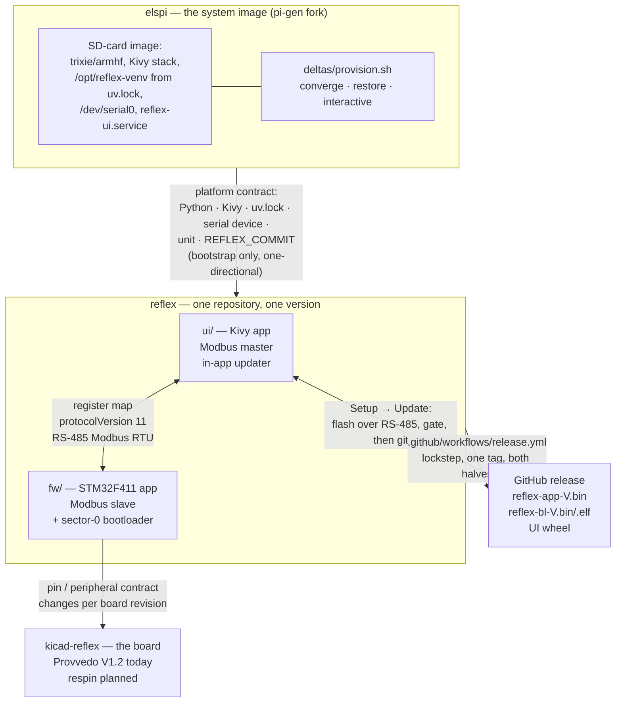

# System architecture

Reflex is four parts in three repositories, joined by three contracts. This
page is the map: what the parts are, where each one's truth lives, and how each
seam is held so that two halves of a machine-tool controller cannot quietly
disagree.

**This page is the shape. The dated ADRs under
[`decisions/`](https://github.com/Funkenjaeger/reflex/tree/integration/decisions)
are the reasoning**, including the alternatives that were rejected. Where the
two disagree, the ADRs are authoritative about *why* and this page about *what
is wired to what*.

!!! info "Provenance"
    Written 2026-09-13 from the repositories as they stand at reflex
    `5a5ee43`. Every claim below is a path you can open. Where a mechanism is
    **planned rather than built**, it says so and names the task that carries
    it — a plan stated as a fact is the failure mode this page exists to avoid.

---

## The four parts

| Part | Repository | What lives there |
|---|---|---|
| **UI** | `Funkenjaeger/reflex`, `ui/` (public) | Kivy touchscreen app, Modbus **master**, operator workflow, configuration, the in-app updater |
| **Firmware** | `Funkenjaeger/reflex`, `fw/` (public) | STM32F411 application — 50 kHz motion ISR, FreeRTOS, Modbus RTU **slave** — plus the sector-0 field bootloader and a native emulator |
| **Hardware** | `kicad-reflex` (private) | Schematic and board. The board in service today is a third-party **Provvedo V1.2** controller, STM32F411CEU6; the respin baselines Evan's own design |
| **System image** | `Funkenjaeger/elspi` (going public) | A soft fork of [pi-gen](https://github.com/RPi-Distro/pi-gen) that builds the Raspberry Pi SD-card image the UI boots from, plus the provisioning deltas |

**UI and firmware share one repository on purpose**, and §1 below is the whole
reason. They were welded together on 2026-08-17 with full history preserved on
both sides
([ADR](https://github.com/Funkenjaeger/reflex/blob/integration/decisions/repo-structure-monorepo.md)),
and they release together under one version number.

**The hardware is a separate repository because the board is not ours yet.**
Nothing in `reflex` tracks a schematic; the firmware's pin map is hand-written
into `fw/Core/Inc/Ramps.h` today. See §2.

---

## §1 — UI ↔ firmware: a wire contract, and why they are one repository

The seam is a **memory-mapped register map**: `rampsSharedData_t` cast wholesale
into Modbus holding registers, read and written over RS-485 Modbus RTU. It is a
wire contract in the strict sense — both halves must agree on every byte offset
or reads past the point of divergence come back as plausible nonsense rather
than as an error.

**It moves fast.** `protocolVersion` first appears on 2026-08-08 and reached
**10** on 2026-09-07 (`registers/els_stop.yaml`, `protocol_version: 10`) — ten
layout versions in about five weeks. A contract that moves that often cannot be
held by convention.

Four mechanisms hold it, and they are why the halves live together:

**One repository, one release, both halves.**
`.github/workflows/release.yml` is deliberate rather than automatic, takes the
version as an input, and stamps it into both halves even when only one changed.
`v1.2.0` therefore *names a firmware and UI pair*, which is what turns "which
firmware does this UI expect?" from tribal knowledge into a version number.

**The map is generated from one schema per struct.**
`registers/*.yaml` (`els_stop`, `servo`, `input`, `fast_data`) →
`tools/genregs.py` emits the C header, the UI's Python mirrors, a JSON offset
table and
[the published map](../reference/register-map.md). The generator can be
confidently wrong in both directions at once, so two checks sit outside it: the
emitted header carries a `static_assert(offsetof(...))` per field, a
`sizeof` per struct and each struct's placement in `rampsSharedData_t` — **the
compiler, not the generator, has the final vote on padding** — and
`genregs.py --check` in CI fails on any hand-edit to a generated file. It also
refuses to emit at all on a group over its request budget or on a `seq` field
sitting above the payload it acknowledges (the torn-read shape of the
2026-08-22 `takeupSeq`/`takeupResult` bug).

!!! note "Generated today: `elsStop_t` only"
    `servo_t`, `input_t` and `fastData_t` are still hand-maintained on both
    sides under `ui/tests/test_register_map_contract.py`, which bridges the gap
    with hand-placed `_pad` fields — a human doing a compiler's job. The sweep
    is **planned** and bounded to a **byte-identical** layout, so it carries no
    protocol bump, no flash and no bench time. Task: *"Generate the register
    map from one schema instead of hand-maintaining both sides."*

**A `protocolVersion` gate in the updater, with automatic revert.**
The in-app updater flashes firmware first, then **refuses to install the UI
half** unless the freshly flashed application has been *observed* to report an
`idAppProtocolVersion` equal to the `ELS_PROTOCOL_VERSION` of the UI about to be
checked out. Note which two numbers those are: the target is read out of the tag
itself with `git show <tag>:ui/reflex/utils/els_stop_map.py` before anything is
checked out, because comparing against the *running* UI would pass exactly when
the release did not move the protocol and fail exactly when it did. On a refusal
the firmware half is rolled back — `blCommand` 7 REVERT, BACKUP copied into RUN
— so the machine is not left with new firmware under an old UI. The reasoning is
in `ui/reflex/utils/updater.py`'s module docstring and in the
[register-map ADR](https://github.com/Funkenjaeger/reflex/blob/integration/decisions/els-modbus-register-map.md).

**A contract test on every run.** `ui/reflex/utils/devices.py` is compared
against the firmware header on every test run — possible only because the
firmware is always checked out. Upstream, where the halves lived in unrelated
repositories, it was not.

Two handshake registers are permanent by design: `protocolVersion` (the layout)
and `diagSchema` (which diagnostic probe, if any, is compiled into the reserved
block). They are permanent because the deployed pair can always lag the source —
firmware and UI are separately deployed artifacts.

---

## §2 — Firmware ↔ hardware: a pin contract that changes per board revision

The firmware's pin and peripheral assignments (`fw/Core/Inc/Ramps.h`,
`fw/ARCHITECTURE.md`, `fw/reflex.ioc`) are a contract with **one physical board
revision**. A respin moves pins; the respin's working interconnect reference
already moves the step output, an encoder channel and the spares.

**The decision, 2026-09-13: board differences are build targets, not branches.**
A branch per board is a permanent merge tax and guarantees that one board's
fixes arrive late on the other. A build target is a directory.

Planned shape — task *"Make the firmware a per-board build (boards/provvedo,
boards/respin) with a board id and capability flags in the identity window"*:

- `fw/boards/<board>/` holds the pin map and feature flags, selected at
  configure time; CI builds both; releases ship a per-board application asset.
- The **identity window** (fixed base 2048, outside the growing application
  struct — see the ADR) gains a `boardId` register and a capabilities word.
  **`boardId` absent or 0 means Provvedo**, so every board already in the field
  reads correctly without being reflashed first.
- The **updater picks the release asset by `boardId`**, the same way it picks
  `reflex-app-` by name today.
- Introduced with **no behavior change first**, proven by a byte-identical
  build, and the respin then lands as a second board file.

!!! important "The UI keys on capabilities, never on the board name"
    A board name is an identity; a capability is a fact about what is wired. The
    spindle **index** input is the worked example: it is optional at the encoder
    level *regardless of board*, so the UI asks "is an index present?" and never
    "is this the respin?" Keying on the name would make a populated option on an
    old board unreachable and an unpopulated one on a new board a crash.

**The pin map is copied by hand today, and that is the remaining gap.** Planned
— task *"Export the board pinout from the KiCad schematic into the firmware
board header, with a drift test"* — is the same treatment the register map got:
export net → MCU pin → function from the schematic, check the export in *with
the hardware commit it came from*, and fail a test on drift. A hand-copied pin
map is exactly where a respin bug hides.

### Provvedo V1.2 caveats, which belong in its board file

Three, all of them properties of the board rather than of the firmware, and all
three currently mitigated in common code:

| Caveat | State today |
|---|---|
| **The step output is driven from a spare pin**, a workaround for the board's step-output defect: the ISR writes the step pulse to both the nominal pin and the spare. | Documented in `fw/todo.md` ("Hardware workarounds"). `fw/ARCHITECTURE.md` and `fw/Core/Inc/Ramps.h` still describe the nominal pin as the step output, so the two disagree — **being reconciled against the Provvedo schematic before the pin is named in a board file.** |
| **BOOT0 is not connected**, so every reset samples a floating pin and boot mode is nondeterministic. Observed: the board booted the factory ROM bootloader unaided on 2026-09-07, and 3 of 7 reset-into-bootloader cycles landed in ROM on 2026-09-12. | Mitigated in software. Bootloader entry is a **jump**, not a reset, and both jumps reset the ART instruction/data caches before handing over (`fw/Core/Src/els_boot.c`, `fw/bootloader/src/bl_hw.c`) — a jump leaves the caches' lines valid, and a stale line of the outgoing image executing inside the incoming one cost one full watchdog period on the first over-the-wire update, 2026-09-13. **Power-on and a watchdog-strike reset still sample BOOT0.** |
| **`MTR_ENA` has no pull-down**, so with the MCU not driving, the drive's enable line floats. | Unmitigated in hardware; a pull-down on this net and on the step net is respin scope. A floating enable on a lathe is not acceptable, which is why the respin makes "MCU not running" mean "drive disabled" with a resistor. |

The register-map ADR's bootloader design already reflects one of these: the
RS-485 driver enable is derived from TXD *in hardware* on this board, so the
firmware does no direction handling at all. The respin moves that to a driven
GPIO — which is a board capability difference, not a firmware preference.

---

## §3 — Firmware and UI ↔ the system image: a loose, one-directional platform contract

The image supplies a platform: a 32-bit trixie userland, Python, the SDL2/Mesa
libraries Kivy renders through, a display with no X server, the UART freed from
the serial console at `/dev/serial0`, `uv`, a venv built from `reflex`'s own
`uv.lock` with Kivy already compiled, and `reflex-ui.service`.

**It is deliberately one-directional: the image is the bootstrap, and the in-app
updater does everything after it.** A fresh card is flashed and provisioned
once; every subsequent firmware and UI change arrives through *Setup → Update*.
That is why the image may be months old and still correct, and why the seam does
not need versioning as tightly as §1.

Three facts make it a real contract rather than an accident:

- **The dependency set is baked, not resolved at provision time.** No
  `cp313`/`armv7l` Kivy wheel exists, so somebody compiles Kivy from source. The
  image does it, once, so that recovery is *flash → restore → run* and does not
  depend on a package index still serving one exact source archive on the day
  the SD card dies in a machine shop. The consequence, accepted explicitly: the
  image and the app become a **version pair**, and the lockfile is *vendored*
  into the image build at a pinned `REFLEX_COMMIT`.
- **The image declares itself.** `/etc/elspi-image.json` (written by
  `stage-elspi/11-manifest`) states the paths, the service user, the DRM mode
  and the `reflex_lock_commit` the venv was built from, so the verification
  harness and the provisioning deltas can *ask* rather than assume.
- **One directory cannot be regenerated.** `/var/lib/reflex-config` holds
  commissioned machine data measured off the physical lathe — axis geometry,
  servo polarity, backlash calibration, scale counts. Provisioning **restores it
  or fails loudly**; it never invents defaults.

Planned — task *"Give the elspi image an `/etc/elspi-release`, and reflex a
minimum-image line the updater can refuse on; fix `test-lockfile-drift.sh`"*:

1. `/etc/elspi-release` in the image: one file naming the image build, the
   pi-gen commit, the baked `REFLEX_COMMIT` and the Python/Kivy/`uv` versions.
2. A **minimum image** line per reflex release, which the updater refuses on
   with a reason — the same shape as the `protocolVersion` gate. Most releases
   will not move it; one that needs a new system package will.
3. A compatibility table in the image repository: image release → reflex
   releases known to run on it.
4. The **lockfile-drift test is this contract's tripwire** — it compares the
   image's vendored lock against the repository's. It is failing as of
   2026-09-13, which is the contract already telling the truth about itself.

---

## Backward compatibility: which boards stay supported

**Provvedo stays supported, as a build target, for as long as it is the only
board anyone else can have.** The respin is Evan's own design; nobody else has
it. Dropping Provvedo support would mean nobody but the author can run Reflex,
which is the opposite of the reason the project is public.

If the original developer ships a revised board of his own, **it becomes a third
target**, and the BOOT0 caveat then narrows to V1.2 only. The floating BOOT0 is
being reported upstream to him — task *"Report the floating BOOT0 to the Provvedo
board's developer, and plan support for a revised board if he ships one."*

Board caveats are documented **per board**, not as global warnings: a caveat that
applies to one revision and is stated globally teaches everyone to ignore it.

---

## How the pieces reach the machine

### The release path

`.github/workflows/release.yml`, run on request rather than on push, from `main`
(full release) or `dev` (pre-release). One version, one tag, both halves:

| Asset | What it is |
|---|---|
| `reflex-app-<V>.bin` | The **application**, linked at the bootloader's RUN slot `0x08020000` and carrying the image header (`magic`, length, CRC32, build rev) that a Modbus flash checks. The only firmware image `modbus-flash.py` will accept. |
| `reflex-bl-<V>.bin` / `.elf` | The **field bootloader** for sector 0. Installed with a programmer, once, by `fw/scripts/provision.sh`. |
| The UI wheel (plus sdist and `SHA256SUMS`) | The UI half's build artifacts. |

!!! warning "`reflex-fw-<V>.bin` was retired on 2026-09-13"
    It was the legacy no-bootloader image at `0x08000000`, published under one
    explicit end condition — that it ships until no board is left on that layout
    — and the known-legacy list emptied on 2026-09-12. Releases tagged before
    2026-09-13 still carry it. The name is worth knowing for one reason: it is
    the glob anyone writes by hand, it matches nothing that can be flashed over
    the wire, and `modbus-flash.py` refuses it before erasing anything. Reach
    for **app**, not **fw**.

    Retiring the asset did **not** retire `fw/scripts/flash.sh`, which builds
    the legacy image locally and never consumed a release asset. It stays as the
    programmer-based recovery tool.

### The update path — *Setup → Update*

The normal path, and it needs no terminal at the machine. Firmware first,
because the firmware half is the **recoverable** one: the bootloader is resident
and independent of the application, so new firmware under an old UI still has a
working screen and a way back, whereas a new UI over failed firmware leaves the
operator with nothing that can fix it.

1. **Preflight**, before anything is touched — tags fetched over HTTPS, a clean
   checkout, `uv` present, the firmware image downloaded and validated. Anything
   missing stops here with nothing changed.
2. **Flash over RS-485**, through the bootloader the UI's own link reaches:
   enter the bootloader **by jump**, erase STAGING, stream 200 bytes per FC16,
   verify, apply (RUN is backed up to BACKUP, STAGING copied into RUN, every
   transition journaled in flash first), jump. About thirteen seconds. The DRO
   stops for the duration because the flasher needs the serial port.
3. **The gate.** Read the identity window and compare the flashed application's
   `idAppProtocolVersion` against the target UI's `ELS_PROTOCOL_VERSION`. There
   is no confirm dialog and no code path past it.
4. **The UI half** — check out the tag, `uv sync`, restart the service.
5. **REVERT on a refusal at step 3**, one step only: BACKUP holds exactly the
   outgoing image, because APPLY's first act was to put it there.

The command-line equivalents, and the `flash.sh` warning, are in
[Installing on a Pi](../setup/installing.md#updating-later).

### The provisioning path — a new card

Raspberry Pi Imager **2.x**, pointed at the image's own one-entry OS list:
`rpi-imager --repo <…>/os_list.json`. That entry declares
`init_format: cloudinit-rpi`, which is what makes Imager offer its
customization page — hostname, the account password, an SSH public key, Wi-Fi,
country — and write it to the boot partition for cloud-init. A first-boot unit
in the image then **overwrites that seed on the card**, so credentials do not
persist in cleartext on a partition any machine with a card slot can read. No
credential is committed and none is baked into the image.

!!! danger "Do not use Imager's *Use custom* and pick the image file"
    Imager 2.x never offers the customization page for a local file and does not
    say so. You get a card with no password, no key and no network — and a
    first-boot seed unit with nothing to consume.

Then, on the Pi, `deltas/provision.sh` in three phases with deliberately
different failure contracts: **converge** (idempotent and retryable — app
checkout, `uv sync --no-dev`, the unit, the DRM drop-in), **restore** (refuses
to invent data — the commissioned config, hard failure if absent), and
**interactive** (blocks on a human). Nothing starts the application: that is a
deliberate act after someone has looked at the restored values.

### The recovery path — a programmer at the machine

A programmer (SWD / ST-Link) is needed for exactly three things: a virgin board,
option bytes, and a controller that will not answer over Modbus at all.

- `fw/scripts/provision.sh` — the **current** layout: bootloader into sector 0
  and the application into the RUN slot behind it. This is the only time the
  programmer is needed on a new board; every later firmware update goes over the
  wire.
- `fw/scripts/flash.sh` — the **legacy** layout, one image at `0x08000000` and
  no bootloader. It reads the board first and writes only over a legacy
  application it recognizes or an erased sector 0; anything else, the bootloader
  included, is a refusal.

!!! danger "Power-cycle the controller after a programmer-based flash"
    A reset alone does not reliably start new firmware on this board, and
    `Verified OK` confirms what was *written*, not what is *executing* — so both
    programming and verification report success while the old firmware keeps
    running, with no error anywhere. Over-the-wire updates do not have this
    problem: the bootloader validates and jumps.

---

## Where things are

| Repository | Path | What lives there | Who owns the truth |
|---|---|---|---|
| `reflex` | `fw/` | Firmware application, sector-0 bootloader, native emulator | The firmware for anything real-time; **the compiler** for the register layout |
| `reflex` | `ui/` | Kivy app, Modbus master, in-app updater | The UI for operator workflow, configuration and display |
| `reflex` | `registers/*.yaml` | One schema per generated struct: `elsStop_t`, `servo_t`, `input_t`, `fastData_t` | **The** source for those blocks; both sides are generated from them |
| `reflex` | `tools/genregs.py` | The generator, and its `--check` guard | — |
| `reflex` | `decisions/` | Dated ADRs with their rejected alternatives | The reasoning behind every contract on this page |
| `reflex` | `.github/workflows/release.yml` | The lockstep release | Which version names which pair, and the asset names |
| `reflex` | `fw/bootloader/README.md` | Flash geometry, anti-brick behavior, bring-up | The bootloader's own behavior |
| `reflex` | `fw/Core/Inc/Ramps.h` | Pin map and peripheral assignments | The board — **hand-copied today**, see §2 |
| `kicad-reflex` | `docs/els-respin-interconnect.md` | Target pinout, the ROM-owned pin check, verified vs not | The schematic; this document is a hand-made cross-reference until the export exists |
| `elspi` | `stage-elspi/` | The added pi-gen stages — everything that makes this image elspi rather than plain Raspberry Pi OS | What is in the image |
| `elspi` | `stage-elspi/08-venv/files/` | The vendored `pyproject.toml`, `uv.lock` and `REFLEX_COMMIT` | `reflex`'s `uv.lock`; this is a pinned mirror with a drift test |
| `elspi` | `deltas/` | Converge, restore, interactive; `provision.sh` | Provisioning |
| `elspi` | `SEAM.md`, `FORK.md` | Where the image ends and provisioning begins; the merge discipline | The ratified image/delta split |
| the machine | `/var/lib/reflex-config` | Commissioned machine data | **The lathe.** Restore-only; never generated |
| the machine | `~/firmware/flashed.json` | What has been flashed, per flash | The record the identity register is cross-checked against |

---

## Related pages

- [What Reflex changes](../vs-upstream.md) — the fork's divergences, including
  the FW/UI seam as a contract and what is explicitly *not* claimed.
- [ELS safety case](els-safety-case.md) — what protects the operator, in which
  state, against which failure, and where nothing does.
- [ELS command channel](els-command-channel.md) — the design for moving
  transition legality into the firmware.
- [Register map](../reference/register-map.md) — the generated map itself.
- [Installing on a Pi](../setup/installing.md) — the procedure, end to end.
