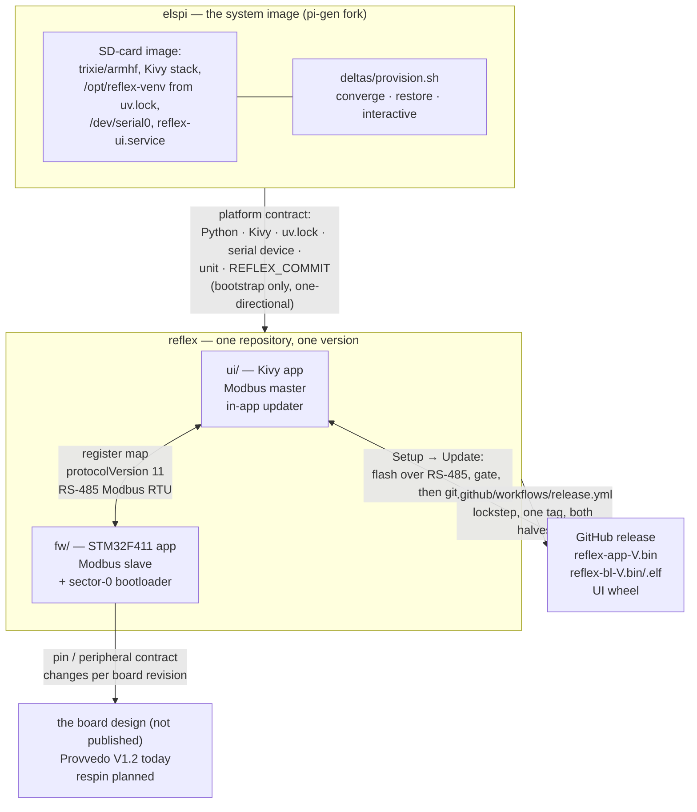

# System architecture

Reflex is four parts in three repositories, joined by three contracts. The
reasoning, with the rejected alternatives, is in the ADRs under
[`decisions/`](https://github.com/Funkenjaeger/reflex/tree/integration/decisions).

## The four parts

| Part | Repository | What lives there |
|---|---|---|
| **UI** | `Funkenjaeger/reflex`, `ui/` | Kivy touchscreen app, Modbus **master**, operator workflow, configuration, the in-app updater |
| **Firmware** | `Funkenjaeger/reflex`, `fw/` | STM32F411 application (50 kHz motion ISR, FreeRTOS, Modbus RTU **slave**), the sector-0 field bootloader and a native emulator |
| **Hardware** | the board design (not published) | Schematic and board. In service: a third-party **Provvedo V1.2** controller, STM32F411CEU6. The respin is the maintainer's own design |
| **System image** | `Funkenjaeger/elspi` | A soft fork of [pi-gen](https://github.com/RPi-Distro/pi-gen) that builds the Raspberry Pi SD-card image the UI boots from, plus the provisioning deltas |

UI and firmware share one repository because of the register map between them,
and release together under one version number
([ADR](https://github.com/Funkenjaeger/reflex/blob/integration/decisions/repo-structure-monorepo.md)).
The hardware is separate because the board is not ours yet; the firmware's pin
map is hand-written into `fw/Core/Inc/Ramps.h`.

```mermaid
flowchart TB
    subgraph image["elspi — the system image (pi-gen fork)"]
      direction LR
      IMG["SD-card image:<br/>trixie/armhf, Kivy stack,<br/>/opt/reflex-venv from uv.lock,<br/>/dev/serial0, reflex-ui.service"]
      DELTA["deltas/provision.sh<br/>converge · restore · interactive"]
      IMG --- DELTA
    end

    subgraph mono["reflex — one repository, one version"]
      direction LR
      UI["ui/ — Kivy app<br/>Modbus master<br/>in-app updater"]
      FW["fw/ — STM32F411 app<br/>Modbus slave<br/>+ sector-0 bootloader"]
      UI <-->|"register map<br/>protocolVersion 11<br/>RS-485 Modbus RTU"| FW
    end

    HW["the board design (not published)<br/>Provvedo V1.2 today<br/>respin planned"]

    image -->|"platform contract:<br/>Python · Kivy · uv.lock · serial device ·<br/>unit · REFLEX_COMMIT<br/>(bootstrap only, one-directional)"| mono
    FW -->|"pin / peripheral contract<br/>changes per board revision"| HW

    REL["GitHub release<br/>reflex-app-V.bin<br/>reflex-bl-V.bin/.elf<br/>UI wheel"]
    mono -->|".github/workflows/release.yml<br/>lockstep, one tag, both halves"| REL
    REL -->|"Setup → Update:<br/>flash over RS-485, gate, then git"| UI
```

## The register map between UI and firmware

`rampsSharedData_t` is cast wholesale into Modbus holding registers and read
over RS-485 Modbus RTU. If the halves disagree on a byte offset, reads past it
return plausible nonsense, not an error. `protocolVersion` in
`registers/els_stop.yaml` versions the layout. Four mechanisms hold it.

**One release, both halves.** `.github/workflows/release.yml` runs on request
and stamps one version into both halves, so `v1.2.0` names a firmware and UI
pair.

**One schema per struct.** `tools/genregs.py` reads `registers/*.yaml` and
emits the C header, the UI's Python mirrors, a JSON offset table and
[the published map](../reference/register-map.md). The header's
`static_assert(offsetof(...))` per field, `sizeof` per struct and placement in
`rampsSharedData_t` let the compiler check padding; `genregs.py --check` in CI
fails on any hand-edit. The generator refuses a group over its request budget,
or a `seq` field above the payload it acknowledges.

!!! note "What is generated"
    `servo_t`, `input_t`, `fastData_t` and `elsStop_t` are generated into
    `fw/Core/Inc/Ramps_generated.h`. The parent, `rampsSharedData_t`, is still
    hand-written in `fw/Core/Inc/Ramps.h` and in `devices.Global`, and
    `ui/tests/test_register_map_contract.py` checks that the two agree.

**A `protocolVersion` gate with automatic revert.** The updater flashes
firmware first and **refuses to install the UI half** unless the new
application's `idAppProtocolVersion` equals the `ELS_PROTOCOL_VERSION` in the
target tag (`git show <tag>:ui/reflex/utils/els_stop_map.py`), not in the
running UI. On a refusal the firmware is rolled back (`blCommand` 7 REVERT,
BACKUP copied into RUN). See `ui/reflex/utils/updater.py` and the
[register-map ADR](https://github.com/Funkenjaeger/reflex/blob/integration/decisions/els-modbus-register-map.md).

**A contract test on every run** compares `ui/reflex/utils/devices.py` against
the firmware header.

Two handshake registers are permanent, because deployed firmware and UI can
always lag the source: `protocolVersion` (the layout) and `diagSchema` (which
diagnostic probe is compiled in).

## The pin map between firmware and board

The pin and peripheral assignments (`fw/Core/Inc/Ramps.h`, `fw/ARCHITECTURE.md`,
`fw/reflex.ioc`) fit one board revision; the respin moves the step output, an
encoder channel and the spares. **Board differences are build targets, not
branches**, because a branch per board delays each board's fixes on the other.
Planned:

- `fw/boards/<board>/` holds the pin map and feature flags, chosen at
  configure time. CI builds both; releases ship a per-board application asset.
- The **identity window** (fixed base 2048) gains a `boardId` register and a
  capabilities word. **`boardId` absent or 0 means Provvedo**, so boards in the
  field need no reflash.
- The **updater picks the release asset by `boardId`**.
- The split lands with **no behavior change**, proven by a byte-identical
  build, before the respin's board file.

!!! important "The UI keys on capabilities, never on the board name"
    A capability is a fact about what is wired. The spindle **index** input is
    optional on any board, so the UI asks "is an index present?", never "is
    this the respin?" Keying on the name would make a populated option on an
    old board unreachable and an unpopulated one on a new board a crash.

The planned fix for the hand-copied pin map is to export each net's MCU pin
and function from the schematic, commit it *with the hardware commit it came
from*, and fail a test on drift.

### Provvedo V1.2 caveats

Properties of the board, which belong in its board file:

| Caveat | State |
|---|---|
| **The step output is driven from a spare pin** as well as the nominal one, working around a step-output defect. | The firmware mirrors every STEP pulse onto the spare pin in `fw/Core/Src/Ramps.c`, and the mirroring comes out once a board revision drives STEP correctly. `fw/ARCHITECTURE.md` and `fw/Core/Inc/Ramps.h` still name the nominal pin; to be reconciled against the Provvedo schematic. |
| **BOOT0 is not connected**, so every reset samples a floating pin and boot mode is nondeterministic. The board has booted the factory ROM bootloader unaided, and 3 of 7 reset-into-bootloader cycles have landed in ROM. | Mitigated in software. Bootloader entry is a **jump**, not a reset, and both jumps reset the ART instruction/data caches before handing over (`fw/Core/Src/els_boot.c`, `fw/bootloader/src/bl_hw.c`). A jump leaves the caches' lines valid, and a stale line of the outgoing image executing inside the incoming one costs a full watchdog period. **Power-on and a watchdog-strike reset still sample BOOT0.** |
| **`MTR_ENA` has no pull-down**, so with the MCU not driving, the drive's enable line floats. | Unmitigated in hardware; a pull-down on this net and on the step net is respin scope. A floating enable on a lathe is not acceptable, which is why the respin makes "MCU not running" mean "drive disabled" with a resistor. |

This board derives the RS-485 driver enable from TXD; the respin drives it
from a GPIO.

## The platform contract with the system image

The image supplies a 32-bit trixie userland, Python, the SDL2/Mesa libraries
Kivy renders through, a display with no X server, the UART at `/dev/serial0`
freed from the console, `uv`, a venv built from `reflex`'s `uv.lock` with Kivy
compiled, and `reflex-ui.service`.

The contract is one-directional: the image is the bootstrap, and every later
change arrives through *Setup > Update*, so an old image stays correct. Three
facts hold it:

- No `cp313`/`armv7l` Kivy wheel exists, so the image compiles Kivy once and
  recovery needs no package index. Image and app are a **version pair**, with
  the lockfile vendored at a pinned `REFLEX_COMMIT`.
- `/etc/elspi-image.json` (from `stage-elspi/11-manifest`) states the paths,
  service user, DRM mode and the `reflex_lock_commit` the venv was built from.
- `/var/lib/reflex-config` holds commissioned machine data (axis geometry,
  servo polarity, backlash calibration, scale counts). Provisioning **restores
  it or fails loudly**; it never invents defaults.

Planned:

1. `/etc/elspi-release`, naming the image build, pi-gen commit, baked
   `REFLEX_COMMIT` and Python/Kivy/`uv` versions.
2. A **minimum image** line per reflex release, which the updater refuses on.
3. A table of the reflex releases known to run on each image release.
4. A fix to `test-lockfile-drift.sh`, which compares the vendored lock against
   the repository's.

## Supported boards

Provvedo stays a supported build target while it is the only board anyone else
can have; the respin is the maintainer's own design. A revised Provvedo board
would become a third target, narrowing the BOOT0 caveat to V1.2.

## How the pieces reach the machine

### The release path

`.github/workflows/release.yml` releases from `main` (full) or `dev`
(pre-release):

| Asset | What it is |
|---|---|
| `reflex-app-<V>.bin` | The **application**, linked at the bootloader's RUN slot `0x08020000` and carrying the image header (`magic`, length, CRC32, build rev) that a Modbus flash checks. The only firmware image `modbus-flash.py` will accept. |
| `reflex-bl-<V>.bin` / `.elf` | The **field bootloader** for sector 0. Installed with a programmer, once, by `fw/scripts/provision.sh`. |
| The UI wheel (plus sdist and `SHA256SUMS`) | The UI half's build artifacts. |

!!! warning "Current releases have no `reflex-fw-<V>.bin`"
    It was the legacy no-bootloader image at `0x08000000`; older releases still
    carry it. It is the glob anyone writes by hand, it matches nothing that can
    be flashed over the wire, and `modbus-flash.py` refuses it before erasing
    anything. Reach for **app**, not **fw**.

    Retiring the asset did **not** retire `fw/scripts/flash.sh`, which builds
    the legacy image locally and never consumed a release asset. It stays as the
    programmer-based recovery tool.

### The update path

*Setup > Update* needs no terminal at the machine. Firmware goes first because
it is the **recoverable** half: the bootloader is resident, so new firmware
under an old UI still has a working screen and a way back.

1. **Preflight**: tags over HTTPS, a clean checkout, `uv`, the firmware image
   downloaded and validated. A failure changes nothing.
2. **Flash over RS-485**: jump to the bootloader, erase STAGING, stream 200
   bytes per FC16, verify, apply (RUN to BACKUP, STAGING to RUN, each step
   journaled first), jump. About thirteen seconds; the DRO stops.
3. **The gate**: `idAppProtocolVersion` must equal the target UI's
   `ELS_PROTOCOL_VERSION`. Nothing bypasses it.
4. **The UI half**: check out the tag, `uv sync`, restart the service.
5. **REVERT on a refusal at step 3**: BACKUP holds the outgoing image.

Command-line equivalents are in
[Installing on a Pi](../setup/installing.md#updating-later).

### The provisioning path

Write a new card with Raspberry Pi Imager **2.x** and the image's OS list:
`rpi-imager --repo <…>/os_list.json`. Its `init_format: cloudinit-rpi` makes
Imager offer its customization page (hostname, password, SSH key, Wi-Fi,
country) for cloud-init. A first-boot unit then **overwrites that seed on the
card**, so no credential stays in cleartext. None is committed or baked into
the image.

!!! danger "Do not use Imager's *Use custom* and pick the image file"
    Imager 2.x never offers the customization page for a local file and does not
    say so. You get a card with no password, no key and no network — and a
    first-boot seed unit with nothing to consume.

On the Pi, `deltas/provision.sh` runs **converge** (idempotent: app checkout,
`uv sync --no-dev`, the unit, the DRM drop-in), **restore** (the commissioned
config, hard failure if absent) and **interactive** (blocks on a human). Nothing
starts the application until someone has checked the restored values.

### The recovery path

A programmer (SWD / ST-Link) is needed only for a virgin board, option bytes,
or a controller that will not answer over Modbus.

- `fw/scripts/provision.sh` writes the **current** layout: bootloader in sector
  0, application in the RUN slot.
- `fw/scripts/flash.sh` writes the **legacy** layout, one image at `0x08000000`,
  only over a legacy application or an erased sector 0. Anything else, the
  bootloader included, is a refusal.

!!! danger "Power-cycle the controller after a programmer-based flash"
    A reset alone does not reliably start new firmware on this board, and
    `Verified OK` confirms what was *written*, not what is *executing* — so both
    programming and verification report success while the old firmware keeps
    running, with no error anywhere. Over-the-wire updates do not have this
    problem: the bootloader validates and jumps.

## Where things are

| Repository | Path | Contents | Owns the truth for |
|---|---|---|---|
| `reflex` | `fw/` | Firmware, bootloader, emulator | Real-time behavior; **the compiler** owns the register layout |
| `reflex` | `ui/` | Kivy app, Modbus master, updater | Operator workflow, configuration, display |
| `reflex` | `registers/*.yaml` | One schema per generated struct | Those structs, on both sides |
| `reflex` | `tools/genregs.py` | The generator and its `--check` guard | — |
| `reflex` | `decisions/` | ADRs with rejected alternatives | The reasoning behind each contract |
| `reflex` | `.github/workflows/release.yml` | The lockstep release | Version pairs and asset names |
| `reflex` | `fw/bootloader/README.md` | Flash geometry, anti-brick behavior; bring-up is `docs/setup/bootloader-bring-up.md` | The bootloader |
| `reflex` | `fw/Core/Inc/Ramps.h` | Pin map, peripherals | The board, **hand-copied** |
| `elspi` | `stage-elspi/` | The added pi-gen stages | What is in the image |
| `elspi` | `stage-elspi/08-venv/files/` | Vendored `pyproject.toml`, `uv.lock`, `REFLEX_COMMIT` | A pinned mirror of `reflex`'s `uv.lock` |
| `elspi` | `deltas/` | Converge, restore, interactive; `provision.sh` | Provisioning |
| `elspi` | `SEAM.md`, `FORK.md` | The image/provisioning boundary; merge discipline | The image/delta split |
| the machine | `/var/lib/reflex-config` | Commissioned machine data | **The lathe.** Restore-only |
| the machine | `~/firmware/flashed.json` | One record per flash | What the identity register is checked against |

## Related pages

- [What Reflex changes](../vs-upstream.md): the fork's divergences.
- [ELS safety case](els-safety-case.md): what protects the operator, and where
  nothing does.
- [ELS command channel](els-command-channel.md): moving transition legality into
  the firmware.
- [Register map](../reference/register-map.md): the generated map.
- [Installing on a Pi](../setup/installing.md): the procedure, end to end.
