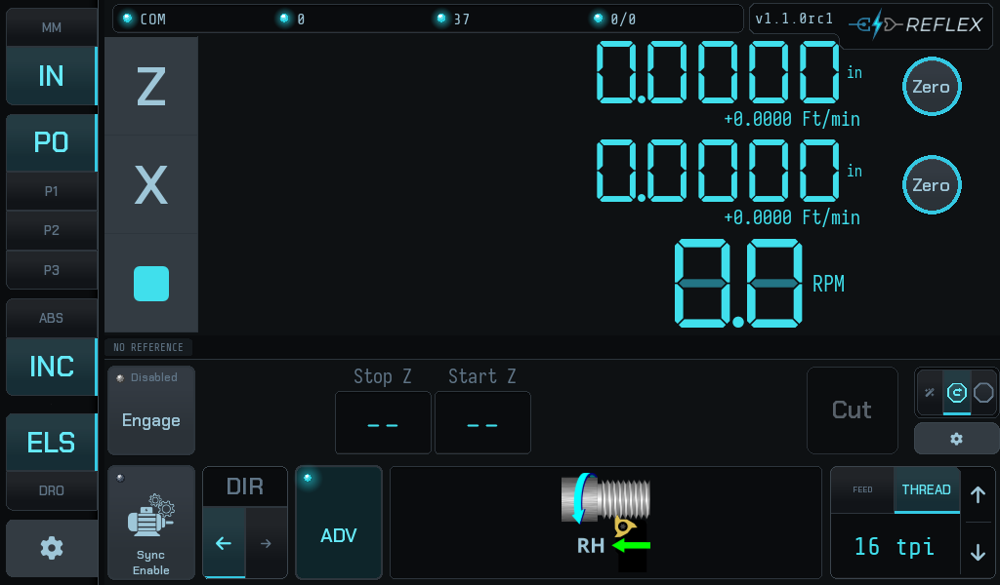

# Cutting a thread

Single-point threading to a shoulder, pass after pass, with the controller
holding thread phase between them.

## Before the first pass

You need four things set, whichever mode you use to set them:

| | |
|---|---|
| **Pitch** | The selector at the bottom right — `THREAD`, then the pitch. |
| **Hand** | Right or left, shown by the illustration and driven by **DIR**. |
| **Stop Z** | The shoulder. |
| **Start Z** | Where each pass begins (retract and wizard modes). |

And one thing calibrated: the **backlash take-up**. If you have not run
[the calibration](../setup/backlash-calibration.md) on this machine, do it
before you cut a thread — the take-up confirmation falls back to a bare motion
floor without it, which is a much weaker check.

## The cycle

1. **Engage.** The LED reads `Armed`.
2. **Close the half nut** and start the spindle.
3. **Press Cut.** The controller takes up the backlash, confirms the carriage
   moved, and feeds in sync with the spindle to the stop.
4. **Back the tool out in X.** Always, and by hand — X is never driven.
5. **Retract**, or wind the carriage back by hand in stop-only.
6. **Feed in** for the next depth of cut and press **Cut** again.

!!! danger "Step 4 comes before step 5, and only the wizard enforces it"
    Retract feeds the carriage back under power. With the tool still in the
    groove it is dragged along the thread.

    The wizard gates the button on the committed **Start ø**; stop + retract has
    no committed diameter, so there the order is yours to keep.

## Thread phase, and why you may open the half nut

The thing that normally forces you to leave the half nut closed for an entire
thread is phase: reopening it loses your place on the leadscrew, and the next
pass cuts a new helix beside the old one.

**Stopping decouples sync anyway.** The firmware pauses spindle sync while the
stop is active, so at the end of every pass the leadscrew is no longer
phase-locked to the spindle — in every stop mode, and whether or not you move
the carriage afterwards. A re-sync is not an occasional recovery; it is what
happens between every pair of passes.

Reflex does not depend on the half nut for it. It re-derives thread phase from
the **Z scale** — the carriage's actual position, which does not care what the
half nut has been doing. That is what makes the retract cycle possible, what
makes a hand-wound return in stop-only work just as well, and why the reference
chip in the gutter matters more than the half nut does.

!!! warning "It still has to be the same reference"
    Phase survives a retract, a stop, and a mode switch. It does **not** survive
    a new job: disengaging and re-engaging the ELS stop starts one, and the
    controller clears the thread reference and any phase offset with it.

    Several messages tell you to re-engage the stop as a remedy. They now say
    what that costs. See [When it refuses](when-it-refuses.md).

## The air pass

Before cutting metal on a thread whose reference you did not just establish by
cutting it — a picked-up thread, or one where anything unusual happened — run an
air pass:

> Back the tool slightly clear of the thread in X, run one pass, and watch the
> tip track the existing groove.

Software cannot detect a tool confirmed in the wrong place. The air pass is what
catches it.

## Multi-start threads

Not yet. Reflex holds **one** thread datum, and the phase-offset feature exists
for widening a groove, not for indexing starts — its correction deliberately
folds within one pitch and biases into the cutting direction, which is exactly
wrong for a second start.

Do not attempt a multi-start thread by dialling in a phase offset of
1/*n* of a pitch. See [Widening a groove](widening-a-groove.md) for what the
offset actually does.
