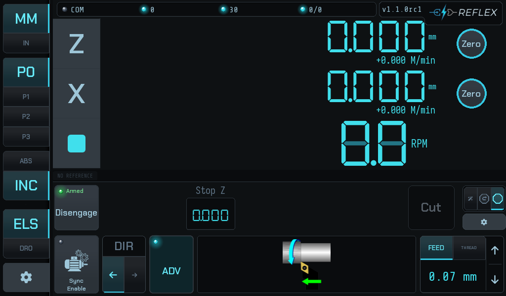

# Feeding to a shoulder

Power feeding onto an electronic stop. This is the simplest useful thing the
machine does, and it is worth doing once before you thread anything.

`FEED` is selected rather than `THREAD`, the rate reads in mm per revolution,
and the illustration shows a turning tool rather than a thread. Everything else
behaves the same way.

## What you are asking for

The carriage feeds under power at the selected rate until Z reaches the position
you set, then stops. The stop is enforced by the firmware's motion ISR, not by
the UI noticing and reacting — it is not subject to how busy the touchscreen is.

## Steps

1. **Choose FEED**, not THREAD, in the selector at the bottom right, and set the
   feed rate with the ▲▼ steppers.

2. **Set the direction** with the **DIR** arrows. This is the direction the
   carriage will travel when the feed starts.

3. **Run the carriage to the shoulder** by hand, and press **Stop Z** to capture
   it. The field shows `--` until it holds a real value — a never-set stop reads
   as `--` rather than `0.000`, so it can never be mistaken for a target at the
   chuck.

4. **Back the carriage off** to where you want the feed to start.

5. **Engage.** The LED beside the button goes from `Disabled` to `Armed`. The
   stop is now live: if the spindle starts unexpectedly, the carriage is arrested
   at the stop rather than running on.

6. **Close the half nut**, start the spindle, and press **Cut**.

The carriage feeds to the stop and holds there. Open the half nut, wind back,
and go again.

!!! tip "Engaging with no stop set does nothing"
    The controller refuses to arm against a stop position it does not have —
    otherwise it would arm against whatever the *firmware* still held from a
    previous session, which could be a different shoulder or a different part.
    Set the stop first, then engage.

## What the controller checks

Before the feed starts, the controller drives the leadscrew through its backlash
and watches the Z scale to confirm the carriage actually moved. If it did not,
the pass does not start:

> Cut aborted — is the half-nut engaged?

That is the fault the check exists to catch. Close the half nut and press Cut
again. Every other refusal is catalogued in
[When it refuses](when-it-refuses.md).

## After the stop fires

The carriage holds at the stop. It does not spring back, and it does not creep:
the firmware stops commanding steps and the servo holds position. Any residual
motion you can measure at the tool is drivetrain compliance and the servo's own
deceleration, not the controller changing its mind.
