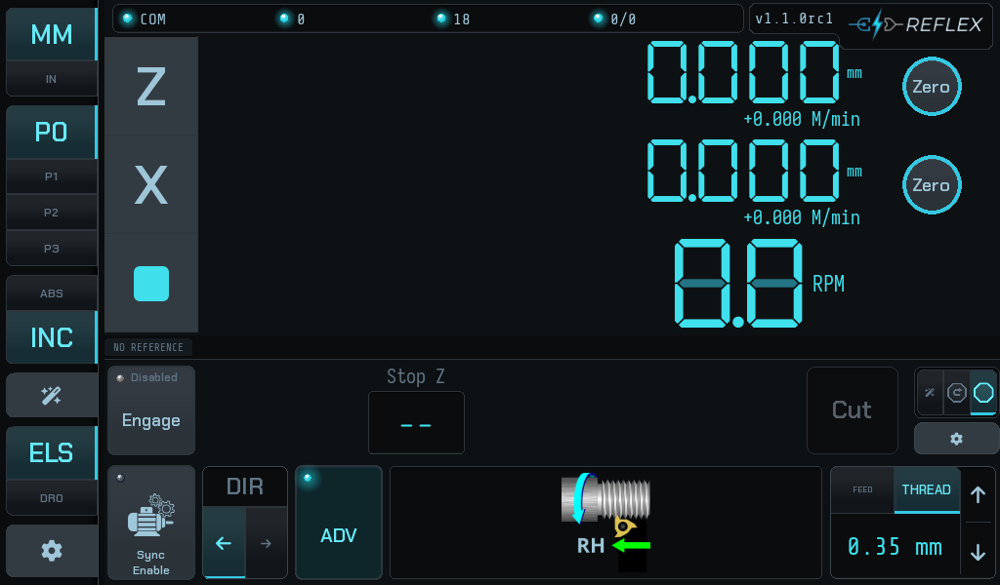
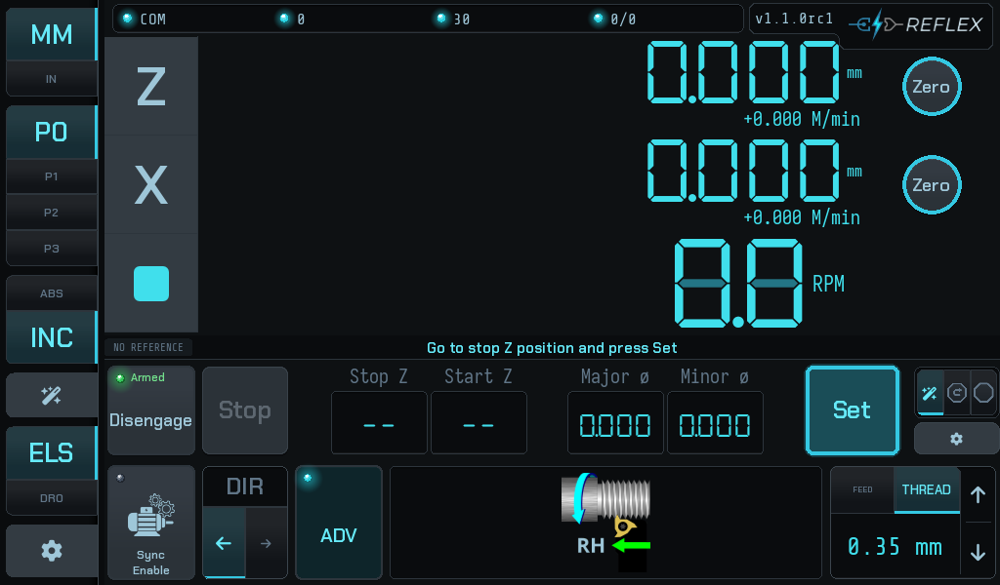
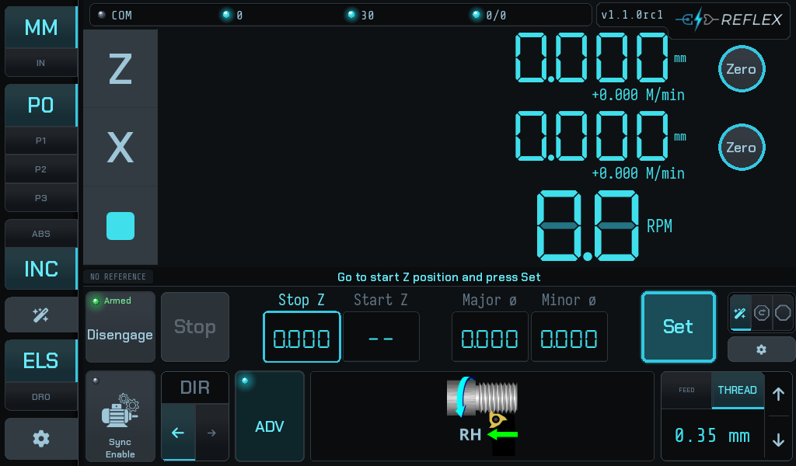
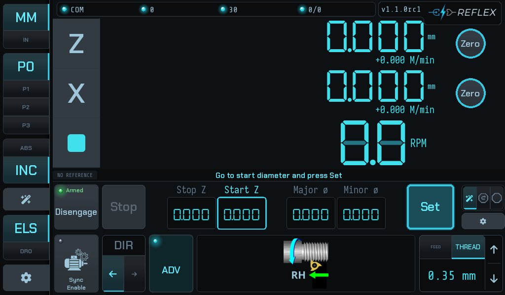
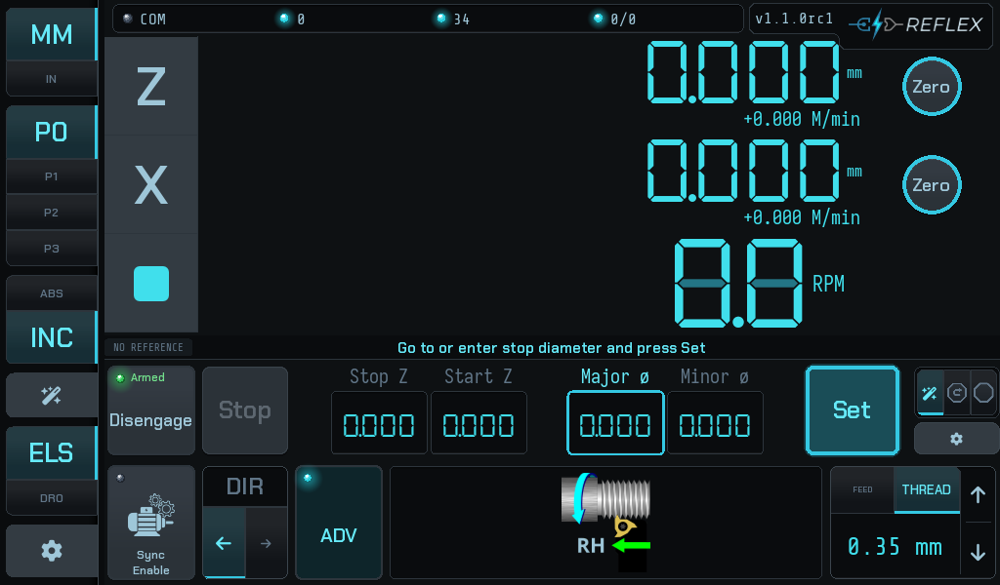
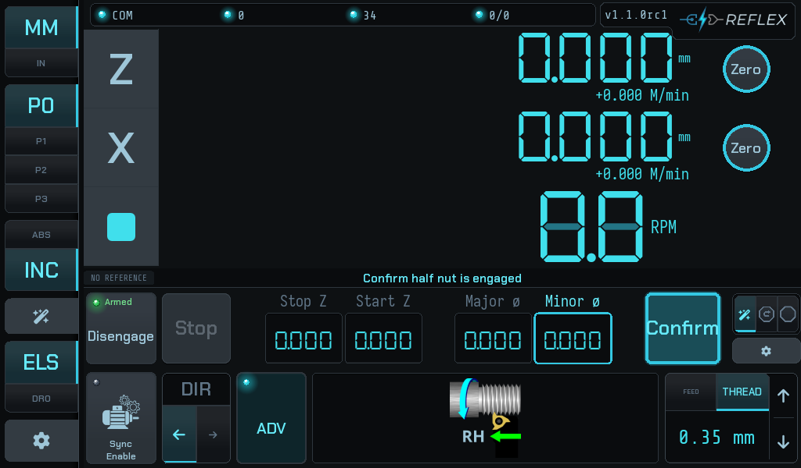
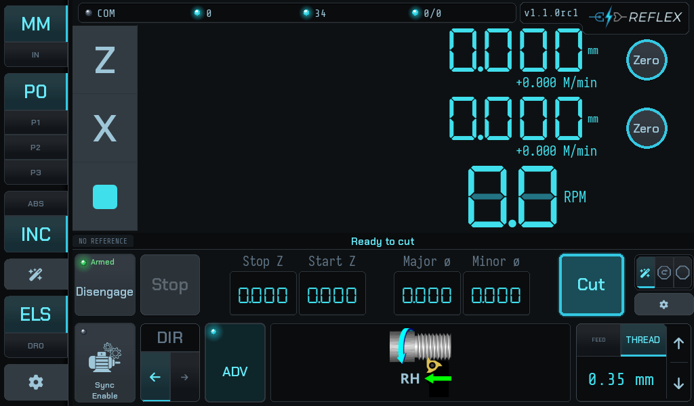

# The three operator modes

They are not difficulty levels. They are three different amounts of the job the
controller takes over, and all three cut the same thread. What changes is how
much you set up first and how much you do by hand between passes.

Cycle between them with the tri-state tab at the right of the advanced bar.

!!! info "None of them is safer than the others"
    The take-up confirmation, the electronic stop and the thread datum are the
    same code in all three. What differs is how much of the *handling* is
    automated.

## Stop-only

One field: **Stop Z**.

Set the shoulder, engage, press **Cut**, and the carriage feeds to the stop and
holds. Everything else — backing the tool out, returning the carriage, taking
the next depth of cut — is yours, exactly as on a manual lathe fitted with a
carriage stop.

This is the mode with the least to get wrong, and it is what the author runs on
his own machine. The controller still confirms the backlash take-up before every
pass and refuses to start one it cannot confirm.

## Stop + retract

Adds **Start Z** and an automatic retract. At the end of a pass the tool comes
out and the carriage returns to the start position on its own, so the cycle is
Cut → Retract → Cut rather than Cut → *four things by hand* → Cut.

This is where **phase re-sync** earns its keep. Between passes the controller
re-derives thread phase from the Z scale, so you are free to open the half nut
and the next pass still lands in the same groove.

## Wizard

The guided setup. Instead of typing values into fields you drive the machine to
each position and press **Set**, and the bar tells you what it wants next.

- 

    **1 — Stop Z.** Run the carriage to the shoulder and press Set. This is the
    one value every mode needs.

- 

    **2 — Start Z.** Run back to where each pass should begin. The retract
    returns here.

- 

    **3 — Start ø.** Bring the tool to the work and press Set. The field being
    captured is outlined.

- 

    **4 — Stop ø.** The finished diameter. Drive to it, or type it in.

- 

    **5 — Confirm.** The one thing the controller cannot check for you is the
    half nut. It asks.

- 

    **6 — Ready.** The button becomes **Cut**, and the cycle runs
    Cut → Retract → Cut.

The prompt above the fields is the wizard's whole interface: it names the next
value, the field it will land in is outlined, and the action button reads what
pressing it will do. **Nothing is captured until you press Set**, so you can
drive past a position and come back.

## Choosing

The wizard puts the most machinery between you and the cut; stop-only the least.
If you already know your numbers, typing them into stop + retract is faster than
walking the wizard. If you are setting up a part you have not cut before, the
wizard stops you forgetting a value.
