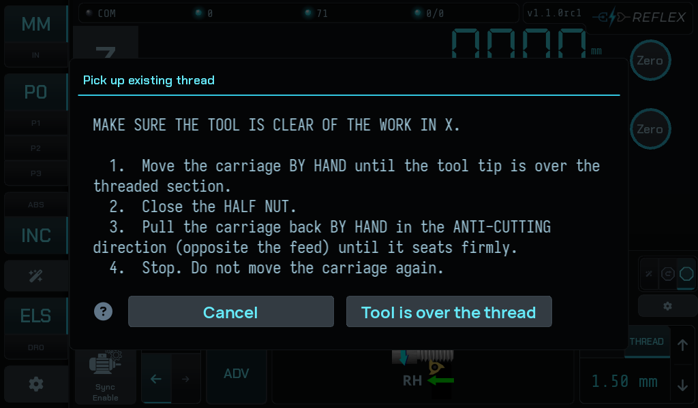
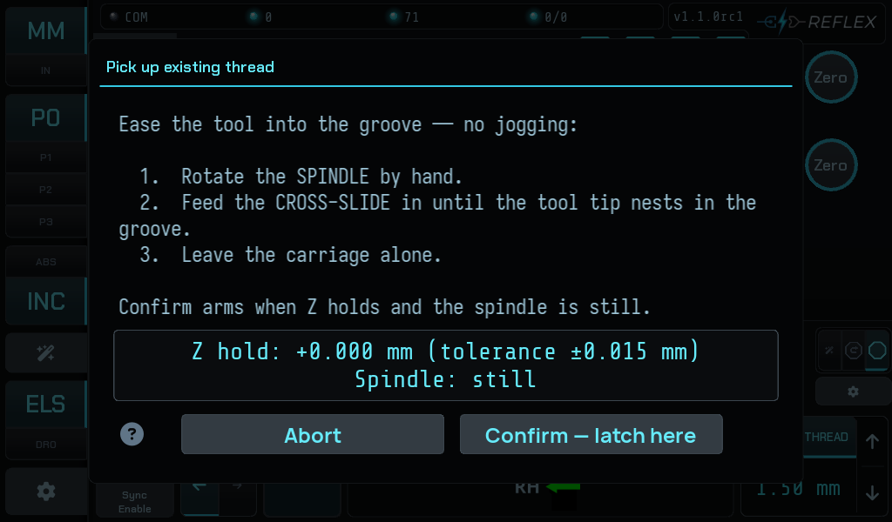
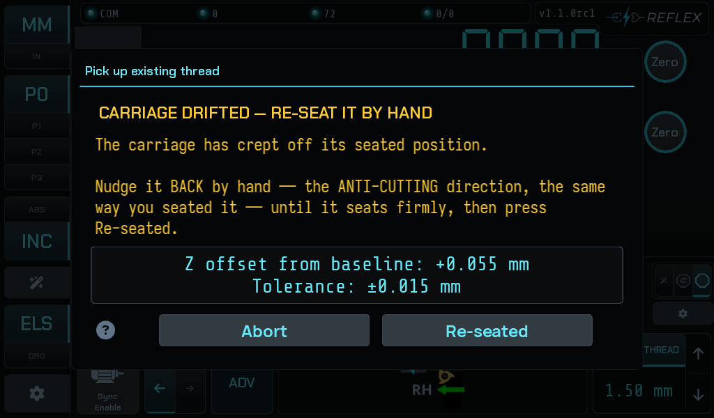
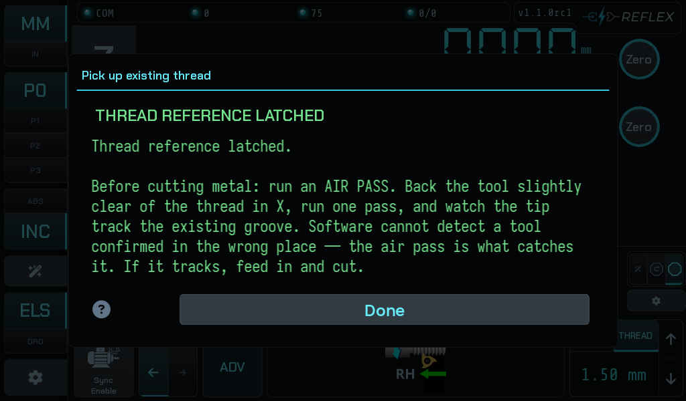
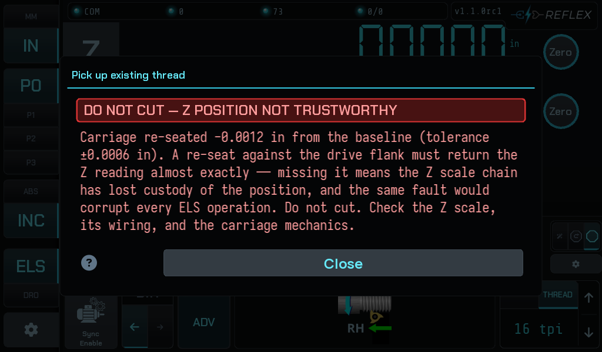
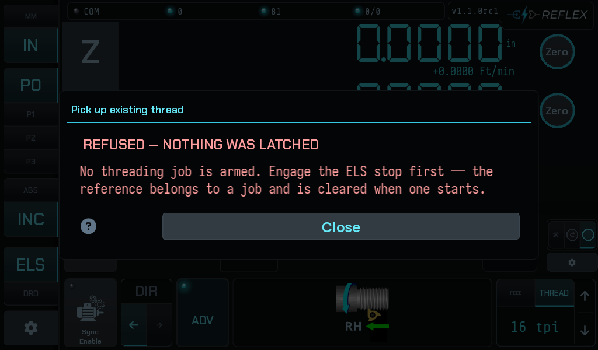

# Picking up an existing thread

Re-establishing the thread reference on work this job did not cut — a re-chucked
part, a thread cut elsewhere, a damaged thread being chased. The controller
cannot know where the existing helix is, so you show it, and it latches a datum
at that instant. From then on every pass follows the existing groove.

## 1 — Seat the carriage

The first screen is about the **carriage**, and it opens with a warning:

> MAKE SURE THE TOOL IS CLEAR OF THE WORK IN X.

Then:

1. Move the carriage **by hand** until the tool tip is over the threaded
   section.
2. Close the **half nut**.
3. Pull the carriage back **by hand** in the **anti-cutting** direction —
   opposite the feed — until it seats firmly.
4. Stop. Do not move the carriage again.

!!! info "Why anti-cutting, and why it matters"
    The half nut sits on the leadscrew with free play. Pulling *against* the
    feed seats the carriage on the flank the leadscrew pushes from during a
    pass, so the reference is taken with that play already used up.

    Seated the other way, the first pass begins by falling through the free
    play, and the reference is off by the whole clearance.

    The tool must be clear in X because the software cannot know the major
    diameter — nothing can stop the tool touching the work while you move the
    carriage by hand.

## 2 — Ease the tool into the groove

Now the **tool**, with the carriage left alone:

1. Rotate the **spindle** by hand.
2. Feed the **cross-slide** in until the tool tip nests in the groove.
3. Leave the carriage alone.

Two conditions have to hold at once before **Confirm** arms:

- **Z holds** within tolerance of the position you seated it at.
- **The spindle is still** — shown as a settling percentage while it decays.

The readout gives both live, in your display units. A ±0.015 mm tolerance on a
200 count/mm scale is three counts: this is a tight check, and it is meant to
be. From the seat onward, the carriage position *is* the reference.

## 3 — If the carriage drifts

The same free play that lets you seat the carriage also lets it creep toward the
cut. If Z leaves tolerance, the screen switches to a re-seat:

> The carriage has crept off its seated position. Nudge it **back** by hand —
> the **anti-cutting** direction, the same way you seated it — until it seats
> firmly, then press Re-seated.

A re-seat that lands within tolerance returns you to alignment, and it has
positively proven the Z chain is reading — which is worth something on its own.

## 4 — Latched

The reference chip in the gutter goes to `REF LATCHED`, and the screen tells you
the one thing that matters next:

> Before cutting metal: run an **air pass**. Back the tool slightly clear of the
> thread in X, run one pass, and watch the tip track the existing groove.

Do it. Software cannot detect a tool confirmed in the wrong place; watching the
tip track the existing groove is the only check that can. If it tracks, feed in
and cut.

## When it will not latch

A re-seat that misses the baseline, or a controller that latches somewhere the
screen was not watching, is a **red flag** — not a retry:

> A re-seat against the drive flank must return the Z reading almost exactly —
> missing it means the Z scale chain has lost custody of the position, and the
> same fault would corrupt every ELS operation. Do not cut.

Check the Z scale, its wiring and the carriage mechanics before doing anything
else with the machine. This is not a threading problem; it is a measurement
problem, and it would quietly ruin ordinary feeding too.

And if no Z or spindle axis is mapped, the procedure refuses before it starts.
That is a [commissioning](../setup/index.md) gap, not a fault.
