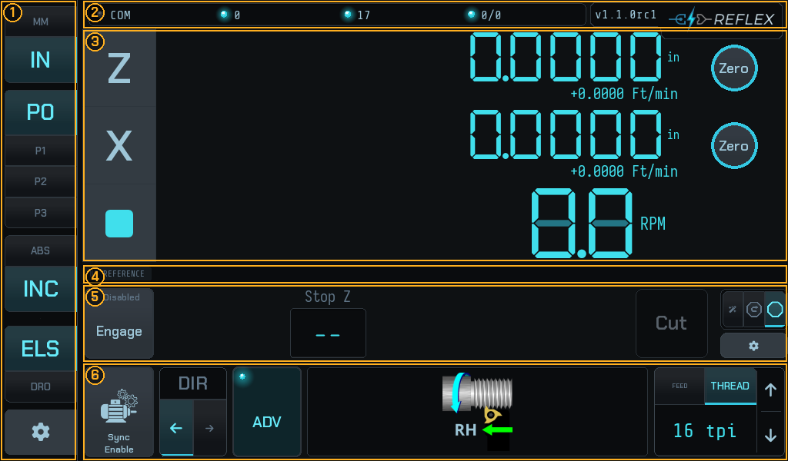
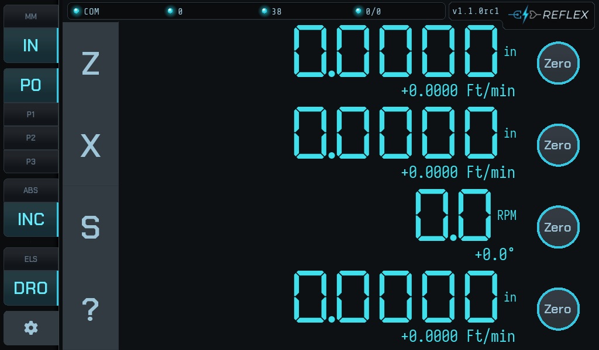
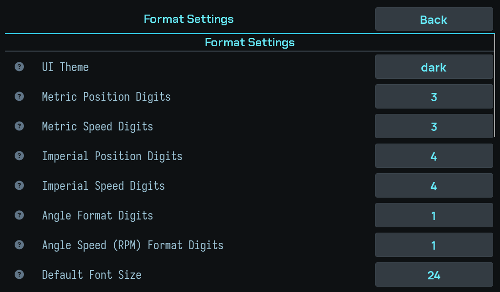
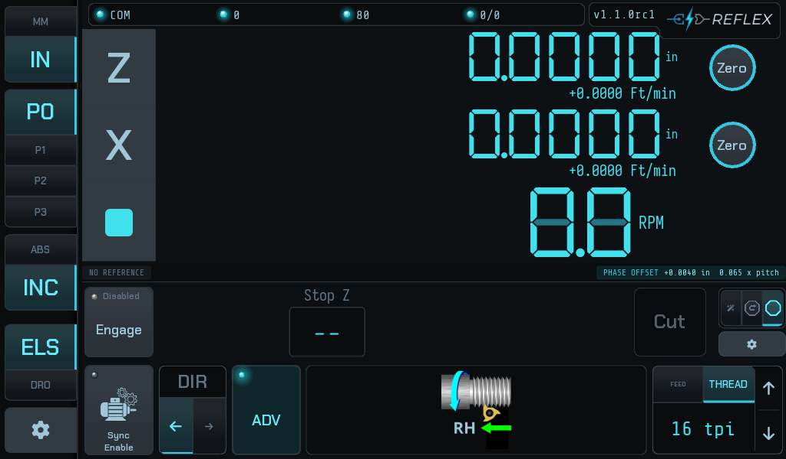

# The screen

The display is 1024×600 and everything on it is reachable by thumb. It divides
into six regions.

!!! info "The boxes are measured, not drawn"
    Those outlines come from the widgets' own geometry at capture time, so they
    move when the layout does. Nobody is keeping a second description of this
    screen in step by hand.

## 1 — The sidebar

Down the left edge, from the top:

| Control | What it does |
|---|---|
| **MM / IN** | Display units. Switching re-renders every readout; it does not move anything. |
| **P0 / P1 / P2 / P3** | Four work-offset slots. Zeroing an axis zeroes it in the selected slot, so you can keep several datums for one job. |
| **ABS / INC** | Absolute or incremental readout. |
| **ELS / DRO** | Operating mode. `DRO` is a plain read-out; `ELS` adds the leadscrew. Tapping cycles. |
| **Gear** | Settings. |

The mode selector only offers what the machine's *use case* allows — a lathe
exposes ELS, other use cases do not, and asking for a mode that is not allowed
silently falls back to DRO rather than half-starting one.

In `DRO` the leadscrew rows go away entirely and the readouts get the whole
screen:

!!! note "No pattern wand on a lathe"
    A wand above ELS/DRO opens the pattern screen — hole circles, lines,
    rectangles — which lays holes out on a face. That is a rotary-table job, so
    **a lathe does not offer it at all**, whatever the *Show Patterns* setting
    says. You will see the button on a rotary table, and the setting alongside
    it:

    

## 2 — The status bar

Across the top: the link indicator (`COM`), the live link counters, the firmware
version and the logo. `COM` lit means the UI and the controller are talking —
if it is dark, nothing below it is live and every number on screen is stale.

## 3 — The DRO

The large seven-segment readouts: **Z**, **X**, and spindle **RPM**, each with a
feed rate beneath it in distance per minute. The `Zero` buttons zero that axis in
the current work offset — not in the machine frame, and not in the controller.

## 4 — The status gutter

A permanently reserved 26-pixel strip. It holds two chips and never covers
anything else:

**Left — the thread reference.** Reads `NO REFERENCE` or `REF LATCHED`. This is
the datum the controller cuts threads against. It persists across a switch to
feed mode — the chip dims rather than disappearing, because the reference is
still there and still usable.

**Right — the phase offset.** Present only when a thread-phase offset is set,
showing the distance and its share of one pitch. See
[Widening a groove](widening-a-groove.md).

When the controller has something to say, a translucent notice strip lands
across this gutter. It is sized so it never lands on top of either chip's text.

## 5 — The advanced ELS bar

The stop controls, and **what `ADV` reveals**. From the left:

- **Engage / Disengage** with its own LED — `Disabled`, `Armed`, or a fault.
- **Stop Z** — the shoulder you are feeding to. In stop + retract and wizard
  modes, **Start Z**, **Major ø** and **Minor ø** appear beside it.
- The **action button** — `Cut`, `Retract`, `Set` or `Confirm` depending on
  where you are. It is blank and recessed when there is no action available.
- The **mode selector** and **settings** on the right.

Its contents depend on the mode — see
[The three stop modes](operator-modes.md).

!!! warning "The gutter belongs to this bar"
    Region 4 is part of the advanced bar, not a separate strip, so collapsing
    `ADV` hides the reference and phase-offset chips along with the controls.

## 6 — The ELS bar

Always present in ELS mode, whether or not the advanced bar is showing:

- **Sync Enable** — spindle-synchronised feed. Independent of the stop: a
  turning spindle drives the leadscrew through sync whether or not a threading
  job is armed.
- **DIR** — the direction the carriage travels under feed.
- **ADV** — collapses and expands the advanced bar above.
- The **thread-hand illustration**, showing right- or left-hand and the
  direction of cut.
- **FEED / THREAD** and the current rate or pitch, with ▲▼ steppers.

With `ADV` collapsed and the stop disengaged, this row plus the DRO is the whole
interface: a read-out with a traditional electronic leadscrew behind it.

!!! tip "The action button always says what it will do"
    If it is blank, the controller has nothing for you to press yet — and the
    instruction line above the fields usually says what it is waiting for.
