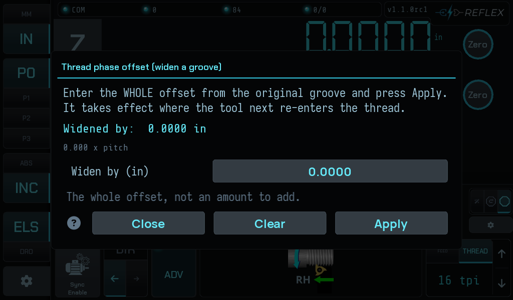
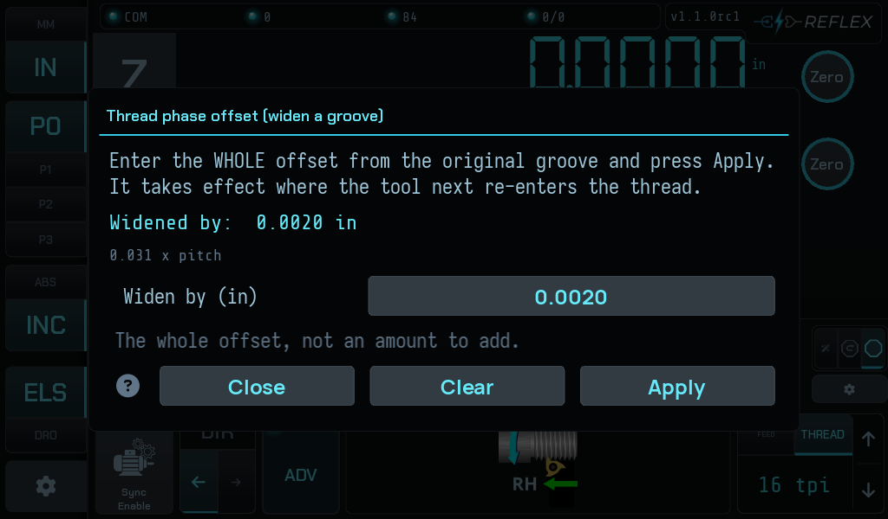
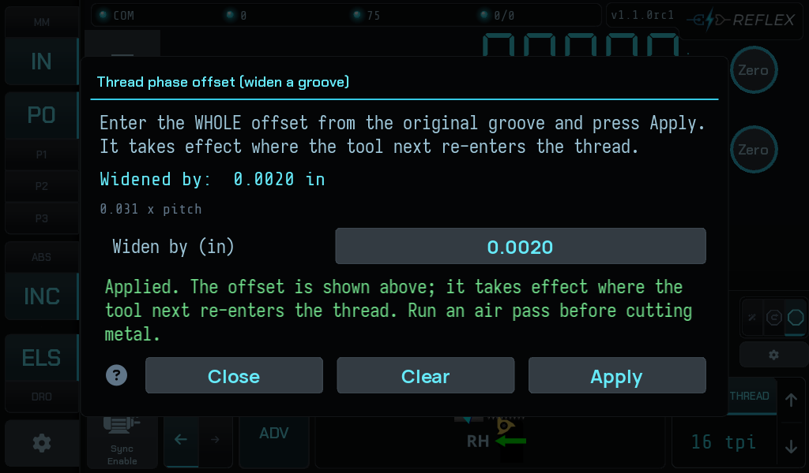
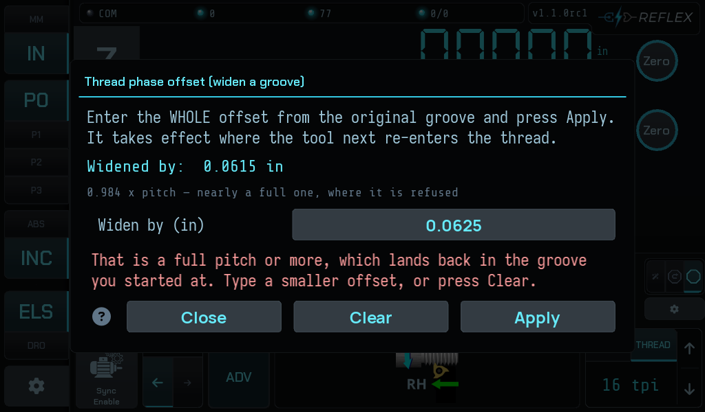
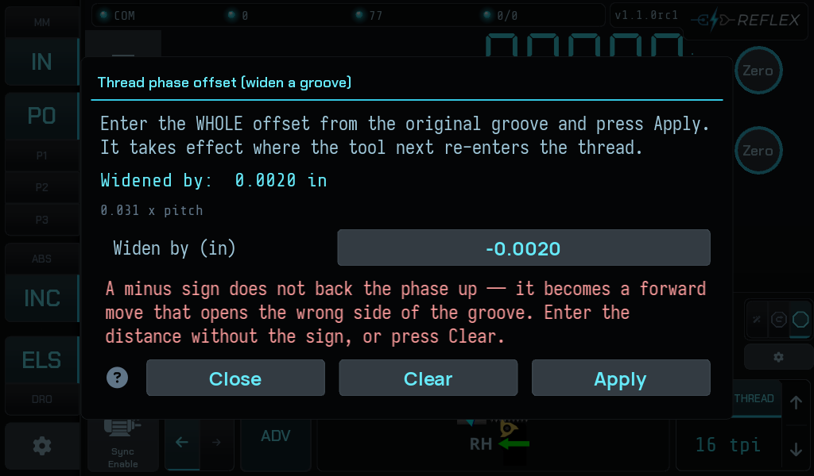
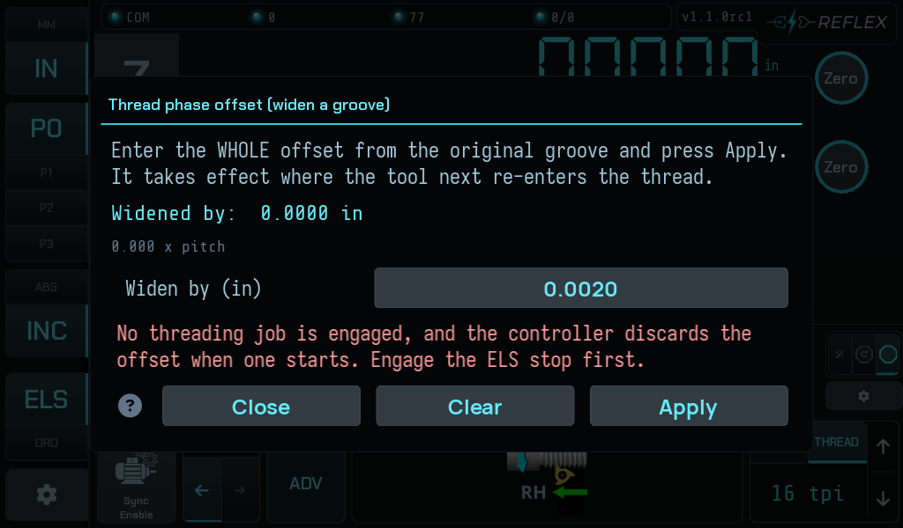

# Widening a groove

Cutting a thread groove **wider than the tool that cuts it**.

Cut the groove with the cutter you have, tell the controller to advance the
thread phase by a small step-over, and cut again — the tool re-enters the same
groove a fraction further along and takes the side off it. Repeat until the
groove is as wide as you want. The workpiece is never re-indexed and the thread
datum is never re-established.

Open it from the **gear** on the advanced ELS bar — it is the second of the two
rows at the bottom of the ELS settings, beside
[Pick up an existing thread](picking-up-a-thread.md#where-to-find-it).

## What it does

The controller carries a **thread-phase offset**: a distance, expressed along
the thread, that shifts where the tool enters the helix. Set 0.002 in and the
next pass cuts 0.002 in along from the original groove, widening it by that
much.

Every step-over goes the same way — you open one side of the groove and keep
going — so the running total on screen **is the widening**: the distance the
groove has actually grown past the width of your cutter, which you can measure
on the part.

**How big a step to take is your decision, not the machine's.** It depends on
the width of the cutter in the toolpost, which nothing in this controller knows.
That is why there are no preset amounts on the screen.

It takes effect **where the tool next re-enters the thread** — not immediately,
and not mid-pass. Applying an offset moves nothing, so it is safe at any point
in a job, mid-pass included.

!!! info "Threading only"
    Turning has no thread phase to shift, so the controller refuses an offset
    in feed mode: *"No thread pitch is set — turning has no thread phase to
    shift. Choose a threading mode and a pitch first."*

## The entry field is absolute

This is the part that catches people. The field is **the whole offset from the
original groove, not an amount to add**. Type `0.10` after applying `0.05` and
the total becomes 0.10, not 0.15.

The modal says so on screen, and the running total is displayed above the entry
so you can always see what the controller is actually holding.

## Applying

Press **Apply**. The total updates, the gutter's right-hand chip appears with
the distance and its share of one pitch, and the screen repeats the advice that
matters:

> Run an air pass before cutting metal.

## The bound

An offset of a full pitch or more lands back in the groove you started at, so it
is refused:

Below a full pitch, the share is shown as a plain decimal — `0.333 x pitch` —
and the line only warns you about the bound once you are within 0.75 of it.

Two other refusals you can meet here, both catalogued in
[When it refuses](when-it-refuses.md):

- 

    A **minus sign** does not back the phase up. It becomes a forward move that
    opens the wrong side of the groove.

- 

    **No threading job engaged.** The controller discards the offset when one
    starts, so it declines to hold one that would evaporate.

## What it is not for

**This is not a multi-start mechanism.** The correction that lets a single datum
survive arbitrary carriage travel folds the phase error within one pitch and
biases it into the cutting direction so it never unloads the backlash take-up.
That behaviour is exactly wrong for indexing a second start, which needs a datum
per start rather than an offset from one.

Dialling in 1/2 or 1/3 of a pitch will appear to work and will not cut a correct
two- or three-start thread. A proper multi-start feature is a separate piece of
work.

## The offset does not survive a new job

Disengaging and re-engaging the ELS stop starts a new job, and the controller
clears the phase offset along with the thread reference. The gutter chips both
go, so you can see it has happened — but nothing warns you beforehand except the
messages that name the cost.
