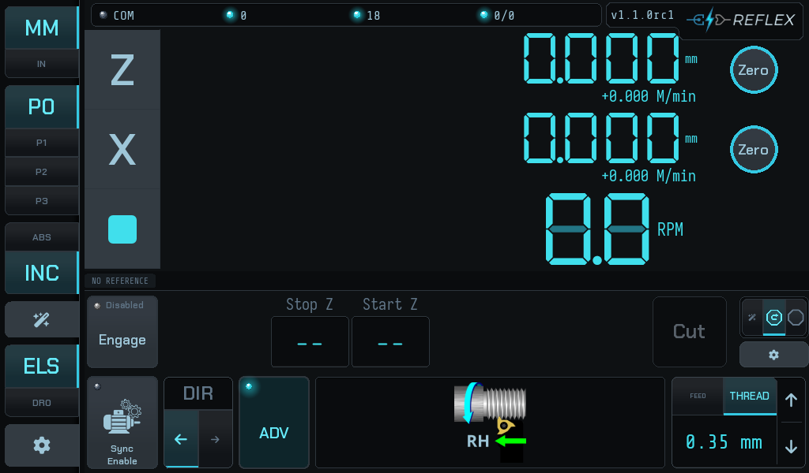
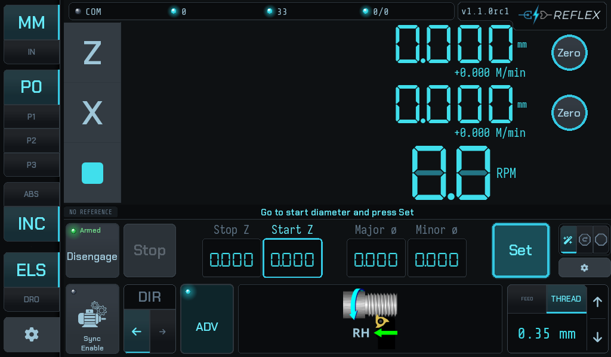
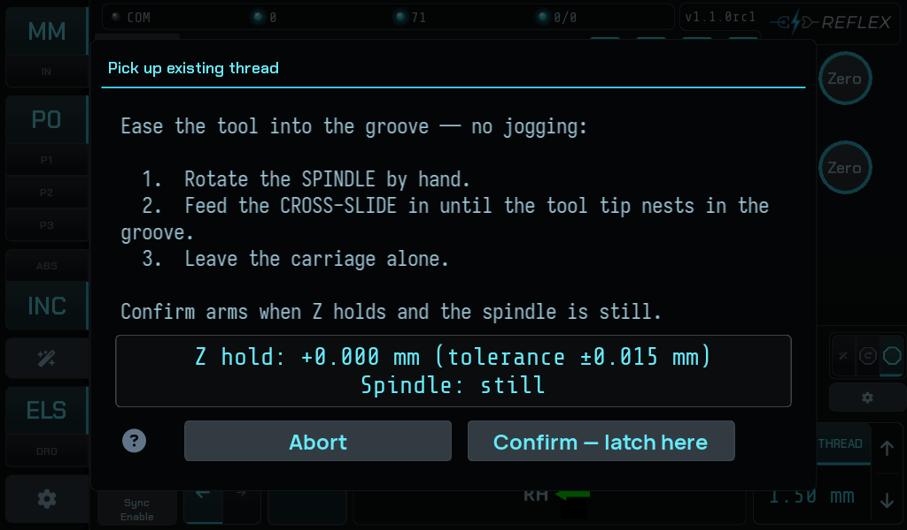
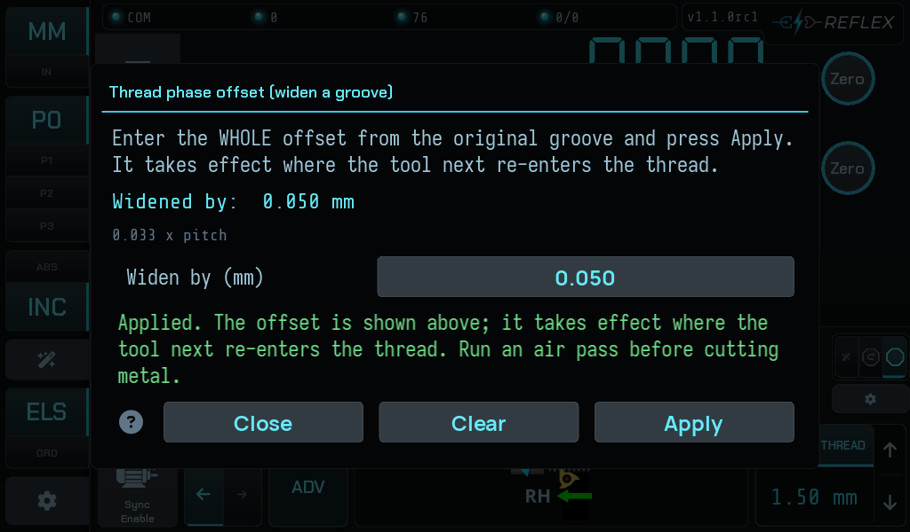

# Reflex

A **digital read-out and electronic leadscrew for manual lathes**: an STM32
motion controller and a Kivy touchscreen, talking RS-485 Modbus RTU.
Threading is the point: holding thread phase across passes is the hard problem,
and most of this guide is about it.

The firmware owns everything real-time — encoders, step generation, the stop.
The UI owns operator workflow, configuration and display.

!!! warning "This drives a machine tool"
    Reflex can start the carriage moving under power. A refusal is the
    controller declining to cut something it cannot verify, not a fault to work
    around — see [When it refuses](guide/when-it-refuses.md).

---

## The one idea to read first

**Reflex will not start a pass it cannot verify.**

Before every pass the controller drives the leadscrew through its backlash and
watches the Z scale to confirm the carriage actually moved. If it did not — an
open half nut, a slipping coupling, a dead scale — the pass does not start.

---

## What it does

### A plain ELS underneath

Spindle-synchronized feed is its own layer, independent of everything that
follows.
Pick a pitch, enable sync, disengage the stop, and Reflex is a traditional
electronic leadscrew — cut with the half nut and your own eyes. Collapse the
advanced bar with **ADV** and the screen is a DRO with a leadscrew behind it.

Everything below adds the electronic stop, which is optional.

### Three stop modes

How much of the job the controller takes over once a stop is armed. They cut the
same thread — what changes is how much you set up first and how much you do by
hand between passes. Cycle between them with the tri-state tab at the right of
the advanced bar.

- 

    **Stop-only**

    One field: **Stop Z**. Feed or thread up to a shoulder and stop, hands off.
    Everything else is yours, exactly as on a manual lathe with a carriage stop.

    The least to get wrong.

    [Feeding to a shoulder →](guide/feeding-to-a-shoulder.md) ·
    [the modes compared →](guide/operator-modes.md#stop-only)

- 

    **Stop + retract**

    Adds **Start Z** and a **Retract** action: command the carriage back to
    the start under power instead of winding it.

    Nothing moves on its own, and **you must get the tool clear in X first** —
    this mode has no gate to stop you.

    [Cutting a thread →](guide/cutting-a-thread.md) ·
    [the modes compared →](guide/operator-modes.md#stop-retract)

- 

    **Wizard**

    Guided setup. Drive to each position and press **Set**; the bar tells you
    what it wants next, and nothing is captured until you press it.

    Useful for a part you have not cut before.

    [Walk the wizard →](guide/operator-modes.md#wizard)

!!! tip "Phase re-sync runs under all three modes"
    Stopping **decouples sync**: the firmware pauses it while the stop is
    active, so after every pass the leadscrew is no longer phase-locked to the
    spindle, whether or not you moved the carriage afterwards.

    So the controller re-derives thread phase from the **Z scale** after every
    pass, in every mode. That is what lets you open the half nut. It matters
    most in **stop-only**, where the carriage comes back entirely by hand.

### Two advanced features

Neither is needed for ordinary threading, and **neither has any meaning outside
it** — both need a thread pitch, and the controller refuses them in feed mode.

- 

    **Pick up an existing thread**

    Re-establish the thread datum on work this job did not cut: a re-chucked
    part, a thread cut elsewhere, a damaged thread being chased. You show the
    controller where the helix is and it latches a reference at that instant.

    A manual procedure — distinct from the automatic per-pass re-sync above.

    [Read the procedure →](guide/picking-up-a-thread.md)

- 

    **Thread phase offset** — widen a groove

    Cut a thread groove **wider than the tool that cuts it**: cut, step the
    phase along by a fraction of a turn, cut again, and the tool takes the side
    off the same groove. Repeat until it is as wide as you want.

    Not a multi-start mechanism — the page says why.

    [Read the procedure →](guide/widening-a-groove.md)

---

## What this version does not do yet

The list below is a plan without dates. The [release notes][versions] are
the current record.

| Not yet | Coming in | What you do instead today |
|---|---|---|
| **Auto-start** — begin the pass when the half nut closes | 1.3.0 | Close the half nut, then press **Cut**. |
| **Auto-advance / virtual compound** — next depth of cut by advancing thread phase from X depth | 1.3.0 | Feed in with the compound slide between passes, as on any manual lathe. |
| **Multi-start threading** | 2.0.0 | Nothing safe. The phase offset is **not** a substitute — see [Widening a groove](guide/widening-a-groove.md#what-it-is-not-for). |

[versions]: https://github.com/Funkenjaeger/reflex/tree/dev/release-notes

---

## Where to start

| If you are… | Go to |
|---|---|
| new to the screen | [The screen](guide/the-screen.md) — every region named |
| choosing how to work | [The three stop modes](guide/operator-modes.md) |
| power feeding to a shoulder | [Feeding to a shoulder](guide/feeding-to-a-shoulder.md) |
| cutting a thread | [Cutting a thread](guide/cutting-a-thread.md) |
| setting up a new machine | [Setup](setup/index.md) — axes, scales, servo, backlash |
| updating to a new release | [Updating Reflex](guide/updating.md) |
| keeping a copy of the settings | [Backing up your settings](guide/backing-up.md) |
| looking at a message | [When it refuses](guide/when-it-refuses.md) |
| seeing UNCOMMISSIONED | [The UNCOMMISSIONED strip](guide/uncommissioned.md) |
| after the meaning of one field | [Reference](reference/index.md) — the in-app help index |

