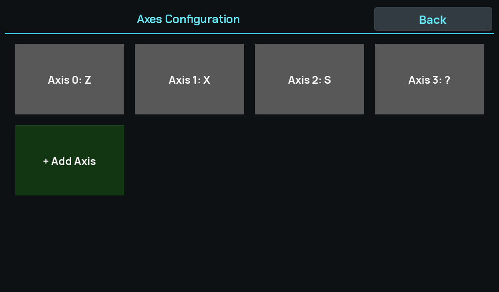
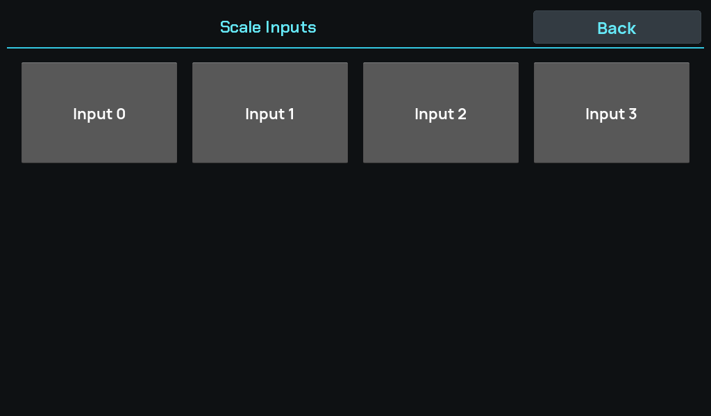
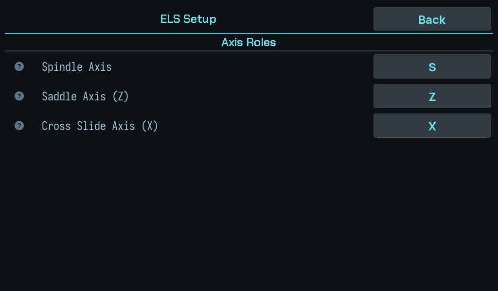

# Axes and scales

Step 1 of [setup](index.md). Nothing here moves the machine.

## Use case

Set the **use case** to lathe. That is what exposes ELS mode at all — asking for
a mode the use case does not allow silently falls back to DRO rather than
half-starting one, so a machine set to the wrong use case looks like a machine
whose ELS is missing.

## Axis roles

Name your axes and point each at a scale input under **Axes**, and give each
input its resolution under **Inputs**:

Then set the **ELS axis roles**: which axis is **Z** (the saddle), which is
**X** (the cross slide), and which is the **spindle**.

These are roles, not names. Calling an axis `Z` does not make the ELS use it —
the roles are a separate setting, and until they are assigned the ELS refuses
anything that needs them:

> No ELS Z axis assigned — map it in ELS settings

## The fourth axis named `?`

The board carries **four** scale inputs and creates one axis per input, so a
machine using three of them still carries a fourth axis called `?`.

That is correct and harmless. The input exists and may be wired later; deleting
the axis to tidy up would throw away a real port.

!!! info "An unnamed axis is not offered as a summed contributor"
    `?` is the marker for *not provisioned yet*. You can assign an input to such
    an axis — that is how it gets provisioned — but it will not be offered as
    the second contributor to another axis's **Sum** transform.

    The reason is specific: a summed axis displays `scale[a] + scale[b]`, but
    the ELS is told a single scale index and tracks `scale[a]` alone. Summing in
    a placeholder that reads zero forever would put a number on screen the
    machine is not following. The ELS refuses to engage against a Z axis derived
    from more than one scale for the same reason.

## Scale resolution

For each input, set the resolution so the DRO reads true.

**Verify it against a dial indicator over a decent travel** rather than trusting
the label on the scale. A label error and a wrong ratio look identical on
screen: both give a readout that moves smoothly and reads plausibly, and they
differ only by a factor you will notice at the part.

A long travel makes the error obvious — over half an inch, a 5% error is
0.025 in, which no dial indicator will hide.

!!! tip "Direction is part of the calibration"
    A scale reading the right magnitude in the wrong direction produces a
    take-up that moves the carriage the wrong way, which the controller catches
    and calls out specifically:

    > Cut aborted — WRONG-way motion. Check the Z scale direction.

    Better to find it here with a dial indicator than at the first pass.

---

Next: [Servo and leadscrew](servo-and-leadscrew.md).
