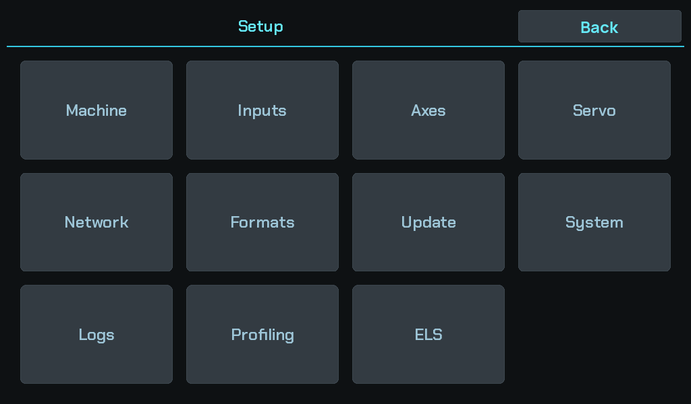

# Setup

First provisioning on a new machine. The order matters — each step depends on
the one before it, and the last one only means anything once the first three are
right.

This page is about teaching Reflex *your lathe*. If the software is not on the
machine yet, start with [Installing on a Pi](installing.md) and come back
here.

Everything below lives behind the **gear** in the sidebar.

!!! danger "The last step moves the machine"
    [Backlash calibration](backlash-calibration.md) drives the carriage under
    power. Nothing before it does. Do not run it with a tool at the work.

| | Step | What it establishes |
|---|---|---|
| 1 | [Axes and scales](axes-and-scales.md) | Which physical input is Z, which is X, which is the spindle — and what a count is worth. |
| 2 | [Servo and leadscrew](servo-and-leadscrew.md) | How a distance becomes leadscrew steps. |
| 3 | [Backlash calibration](backlash-calibration.md) | How much play the drivetrain has, so the controller can confirm a take-up. |

## Why this order

Steps 1 and 2 measure the machine in two independent ways, and **that
independence is what makes a mistake visible**.

The DRO reads from the *scales*, so a wrong servo ratio does not show up there —
the position on screen stays correct while every commanded move is off by the
ratio. Conversely a wrong scale resolution leaves commanded moves correct and
the readout wrong.

Getting either wrong therefore looks like the machine working. The only checks
that catch them are physical: a dial indicator against the readout for the
scales, a known commanded move measured at the part for the servo.

Step 3 depends on both being right, because it measures a distance with the
scales and drives it with the servo.

## Where the field-level detail lives

Every setting named in these pages has its own help **on the machine** — press
the **?** on any settings screen. That is the reference layer and it ships with
the software; these pages are the order and the reasoning.

The topics are indexed under [Reference](../reference/index.md) for reading away
from the lathe.
